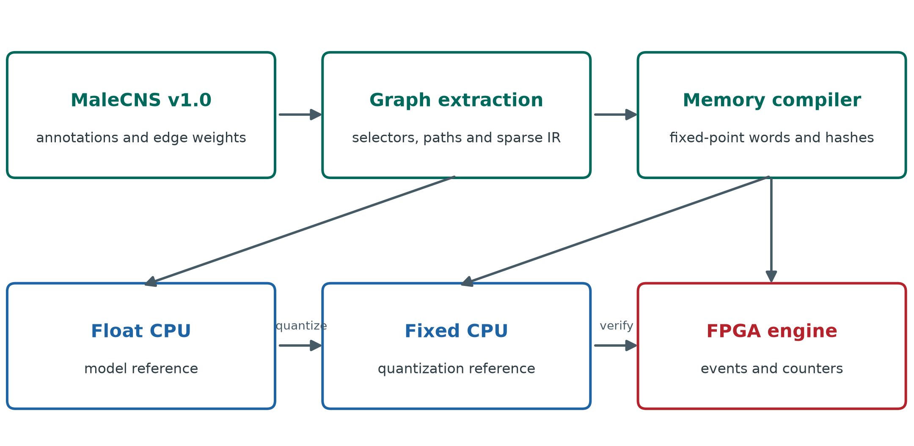
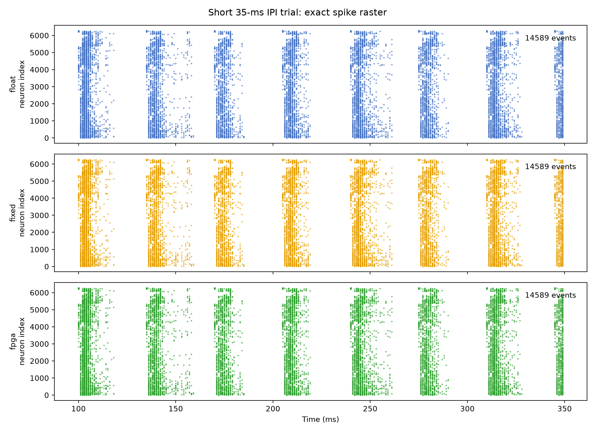

# CNS2FPGA Compiles MaleCNS Subcircuits into a Time Multiplexed FPGA Neural Engine

Research manuscript, 26 September 2026

## Abstract

The MaleCNS connectome provides neuron-resolved structural data for the adult male *Drosophila* central nervous system, but its synapse table is not itself an executable circuit. We built CNS2FPGA to extract path-constrained subgraphs, compile signed weighted connectivity into reproducible memory images, and execute a discrete-time leaky integrate-and-fire (LIF) model on a time-multiplexed FPGA. We tested a courtship-song candidate graph of 6,279 neurons and 350,185 directed weighted edges and a visual-to-steering candidate graph of 226 neurons and 1,730 edges. On an AXKU115 at 200 MHz, the courtship implementation matched fixed-point CPU population counts at every millisecond in 13 stimulus conditions; an eight-pulse trial also matched the ordered individual spike events. Its slowest timestep took 199,063 cycles against a 200,000-cycle deadline. A separately compiled visual graph passed 7,232 full-state RTL comparisons over eight steps and, on the board, exactly matched 560 ordered CPU events in a 250-ms unilateral-input trial. The visual implementation took at most 4,439 cycles per timestep. Five-seed perturbation sweeps and a four-format width sweep delimit numerical behavior. A simplified four-rule type graph lost the prespecified unilateral DNa02 output even though its whole-network event F1 was approximately 0.987. These measurements establish fidelity of a specified connectome-constrained computation across CPU, RTL, and hardware. They do not establish that the LIF output reproduces neural recordings or fly behavior.

## Introduction

The MaleCNS v1.0 resource provides whole-central-nervous-system annotations and aggregate connection weights for male *Drosophila* [1, 2]. The data make it possible to ask how an annotated sensory-to-descending pathway behaves when its actual cell-to-cell connectivity is placed in an executable model. The biological inference is limited: a connectome does not specify postsynaptic receptor action, membrane parameters, an input transduction model, or a mapping from every experimental imaging region to a unique reconstructed cell. Consequently, our first target is an auditable engineering computation, not a complete simulation of a fly.

Existing experimental work identifies an auditory aPN1–vPN1–pC1 pathway relevant to courtship-song perception [3]. We use its annotated nodes and downstream candidates to stress a comparatively large graph. Work on visual object pursuit motivates a second path through LC10a, AOTU019/AOTU025, and DNa02 [4]. That graph tests whether the same extraction, numeric format, compiler, and neuron/synapse engine transfer to a different sensorimotor domain. We use synthetic current pulses rather than a reconstructed acoustic waveform or retinal image, so neither task is a behavioral prediction experiment.

Three comparisons define our evidence. Floating-point CPU versus fixed-point CPU isolates quantization. Fixed-point CPU versus RTL checks the entire virtual-neuron state under a short synchronous test. Fixed-point CPU versus the programmed FPGA checks observable events, counters, and deadlines in physical execution. Keeping these levels separate prevents an exact hardware match from being mistaken for biological validation. We further compare a transparent type-level wiring baseline with the automatically extracted visual graph at a prespecified downstream output. The aim is to show what connectivity detail can matter for this model without treating the baseline as a matched causal control.

## Materials and methods

### MaleCNS source and circuit extraction

We pinned MaleCNS v1.0 annotation, neuron-level neurotransmitter prediction, and aggregate segment-to-segment connectivity Feather files from the official dataset [2]. Each extracted circuit records the source version and file hashes. Configuration selectors resolve named cell groups against the annotations. The extractor streams the weighted connectivity table, retains directed edges with at least five aggregate synapses, computes paths from selected input anchors to selected output anchors, and writes an indexed graph with contiguous sparse-row offsets, neuron and edge tables, anchor flags, and provenance metadata. Path selection is a graph operation; retained nodes are not asserted to be a uniquely defined biological circuit.

For courtship song, selected auditory anchors and annotated aPN1, vPN1, pC1, pIP10, and pMP2 groups produced 6,279 neurons, 350,185 directed weighted edges, and 7,029,800 aggregate synapses. Ninety-three cells received external current. For the visual transfer test, LC10a input anchors and AOTU019/AOTU025/DNa02 relays and outputs produced 226 neurons, 1,730 edges, and 33,748 aggregate synapses. Of 275 annotated LC10a cells, 220 satisfied the configured two-hop input-to-output path condition. The graph includes two AOTU019, two AOTU025, and two DNa02 cells. Its left-input variant keeps the same 226-neuron graph but marks only 109 left LC10a cells for stimulation. Both circuits are compiled by the same implementation with different configurations.

### Discrete time neural computation

The reference model advances in 1-ms steps. At each active-neuron update, the previous membrane voltage is multiplied by the decay factor exp(−1/20), then the external current and weighted spikes from the preceding timestep are added. The weighted input is the sum over presynaptic cells that fired in that preceding step. Threshold is 1, reset voltage is 0, bias current is 0, and a spike starts a two-step refractory counter. A neuron in refractory state or in an explicit silencing condition is held at reset. Each signed edge weight is the aggregate synapse count multiplied by the recurrent gain 0.015 and an engineering sign derived from the presynaptic transmitter prediction. Acetylcholine is assigned +1; GABA and glutamate are assigned −1; unknown or modulatory predictions contribute zero. The sign assignment is not a receptor-resolved physiological measurement.

The fixed-point reference reproduces specified rounding, saturation, refractory, and update order. The selected `safe_wf24` profile uses 34-bit state with 24 fractional bits, 30-bit weights with 24 fractional bits, 32-bit decay with 30 fractional bits, and a 35-bit accumulator. The graph compiler emits neuron parameters, synapse words, row offsets, transmitter-sign data, input mappings, and a global configuration image. It decodes and compares each serialized field in round-trip tests before use. The 226-neuron visual graph uses the courtship compiler and `safe_wf24` format unchanged.

### Hardware architecture and comparison hierarchy

The FPGA engine evaluates virtual neurons sequentially from on-chip memories and accumulates contributions from the preceding timestep's spikes. The board trial interface loads one signed 34-bit scalar input-current word per model step over JTAG AXI-Lite. Input-anchor flags determine which cells receive that word. The host reads summary counters, diagnostic flags, and, when event memory permits, ordered spike records. The large courtship trials export per-step group counts; the short courtship raster and the visual left-input trial export full event sequences. A JTAG host transfer is outside the measured neural-core timestep latency.

The RTL testbench compares voltage, synaptic current, refractory counter, and spike state for every visual neuron at each of eight steps. For each input image this is 226 × 8 × 4 = 7,232 field comparisons. The physical FPGA is checked against the fixed-point CPU at the recorded output interface, not by reading back all internal per-neuron states. A zero mismatch therefore has a deliberately different scope in RTL and on-board results.

### Stimulus and perturbation protocols

The courtship suite has nine equal-pulse inter-pulse intervals (IPI) of 15, 25, …, 95 ms, each with 40 pulses of 3-ms width at current amplitude 1.2. Two 35-ms-IPI conditions use amplitudes 0.8 and 1.4. One condition alternates 20- and 50-ms intervals, and a short 35-ms-IPI condition contains eight pulses for a complete board event raster. The long runs contain 4,308 steps; the short raster contains 350. The response window begins at 100 ms and ends at the trial-specific bound recorded in the protocol lock. We report raw window counts for exact implementation comparisons and divide by pulse count only for IPI response plots. The alternating sequence's last onset precedes the uniform 35-ms sequence's last onset by 15 ms; it is a pattern example, not a strictly duration-matched causal control.

The robustness suite holds the intact 35-ms, 40-pulse stimulus fixed. For each of four perturbation families—random synapse deletion, random neuron failure, Gaussian multiplicative weight jitter, and Gaussian scalar input noise—we used levels 5%, 10%, and 20% and five predetermined seeds per level. Together with the intact trial and four targeted ablations, this yields 65 full-length CPU trials. The perturbation statistic is the absolute difference between perturbed and intact response-window spike counts, divided by the intact count and multiplied by 100. Means and standard deviations across five seeds are descriptive, not confidence intervals. Three input-noise trials, one seed at each level, were also run on the FPGA. This input noise is a common scalar per timestep, not independent noise for each of the 93 input cells. Graph-altering perturbations were CPU-only because the board image was immutable during these trials.

For the visual circuit, CPU trials crossed 20-, 40-, and 80-ms pulse intervals with bilateral, left, and right LC10a input (nine 250-ms conditions). The board trial used the left-input image, 40-ms interval, 3-ms pulses, and amplitude 1.2. These are artificial current injections and do not encode object position, image motion, or visual feedback.

### Wiring baseline and numerical width sweep

The simplified visual baseline keeps the same 226 neuron IDs but replaces cell-to-cell edges with four complete-bipartite type rules: LC10a→AOTU019, LC10a→AOTU025, AOTU019→DNa02, and AOTU025→DNa02. Each synthetic edge receives the median synapse count of its corresponding real type pair. We compare ordered whole-network events and the prespecified DNa02_L/DNa02_R outputs. This baseline changes edge identity, number, degree, and total synaptic weight simultaneously; it cannot isolate one structural feature or measure manual mapping labor.

We evaluated four fixed-point profiles on the visual stimuli and an independent nine-IPI courtship width envelope. Selection of `safe_wf24` for the reported bitstreams preceded the final board comparison. We call a format acceptable in the courtship envelope only if the configured key-response error is within the 5% criterion and saturation constraints pass. An exact match at one stimulus is insufficient to accept a format over the full interval sweep.

### Data recording and reproducibility

The source tables, selection configurations, intermediate graphs, memory images, CPU traces, board captures, Vivado timing/utilization reports, and protocol-lock hashes are retained in the project workspace. Table values and plotted coordinates in this paper are copied from the machine-readable files listed in the accompanying data manifest. No external power meter, independent board replication, or experimental fly response dataset was used for the claims below.

*Figure 1. MaleCNS source tables feed path-constrained extraction and a fixed-point memory compiler. The floating CPU, fixed CPU, RTL, and programmed FPGA occupy distinct verification levels. Arrows describe data and comparison flow, not anatomical connectivity.*

## Results

### Extracted graph and memory footprint

The courtship candidate is 27.8 times larger than the visual candidate by neuron count and 202.4 times larger by directed edge count (Table 1). The serialized courtship logical image contains 23,518,944 bits and the visual bilateral image 154,528 bits. These are compiler-image bits, not physical block-RAM utilization. Even dividing visual image bits by 36,864 gives only a five-BRAM36 aggregate-capacity lower bound; allocating individual files separately gives a nine-BRAM36 lower bound before access ports, state, buffering, and placement. The measured implementations use substantially more physical RAM for those additional structures.

Table 1. Extracted graph and logical memory size

| Measure | Courtship song | Visual to steering |
| --- | ---: | ---: |
| Retained neurons | 6,279 | 226 |
| Directed weighted edges | 350,185 | 1,730 |
| Aggregate synapse count | 7,029,800 | 33,748 |
| Stimulated input cells | 93 | 220 bilateral or 109 left |
| Compiled logical image bits | 23,518,944 | 154,528 bilateral; 152,752 left |

### Courtship computation and physical deadline

All 13 courtship conditions matched between floating and fixed CPU at the ordered individual-event level. On the board, all measured per-timestep population counts matched fixed CPU in the long conditions; the eight-pulse raster additionally matched ordered individual events. The 40-pulse pC1 response-window count rose from 611 at 15 ms IPI to 2,326 at 65 ms and then was 2,238 at 95 ms (Table 2, Figure 2). These are model spike counts under differently timed windows, not a fit to the pC1 calcium or behavioral tuning curve in [3]. The Figure 2 y-axis divides each count by 40 pulses to show the event-normalized response without implying a measured neural firing rate.

Table 2. Courtship pC1 response-window spikes for 40 equal pulses

| IPI ms | Float CPU | Fixed CPU | FPGA | Spikes per pulse |
| ---: | ---: | ---: | ---: | ---: |
| 15 | 611 | 611 | 611 | 15.275 |
| 25 | 1,020 | 1,020 | 1,020 | 25.500 |
| 35 | 1,735 | 1,735 | 1,735 | 43.375 |
| 45 | 1,910 | 1,910 | 1,910 | 47.750 |
| 55 | 2,125 | 2,125 | 2,125 | 53.125 |
| 65 | 2,326 | 2,326 | 2,326 | 58.150 |
| 75 | 2,308 | 2,308 | 2,308 | 57.700 |
| 85 | 2,180 | 2,180 | 2,180 | 54.500 |
| 95 | 2,238 | 2,238 | 2,238 | 55.950 |

*Figure 2. Model response-window spikes per input pulse for vPN1, pC1, pIP10, and pMP2 across nine IPIs. CPU float, CPU fixed, and FPGA traces overlap at the plotted group counts. The FPGA comparison is per-millisecond population count, while float/fixed also matched ordered individual events. Longer IPIs have later response-window ends by protocol; curve shape must not be interpreted as measured fly tuning.*

*Figure 3. Full individual-event raster for the 350-ms, eight-pulse courtship trial. CPU float, CPU fixed, and FPGA output agree on the ordered event sequence. The long courtship trials were not read out as complete individual-event rasters because event capture memory was limited; they were verified through per-step group counts.*

The placed-and-routed courtship implementation met 200-MHz timing with +0.073 ns setup worst negative slack (WNS) and +0.030 ns hold worst hold slack (WHS). It consumed 11,912 LUTs, 4,093 flip-flops, 589 RAMB36, three RAMB18, and four DSPs (Table 3). The slowest observed step took 199,063 cycles, or 995.315 µs. The one-millisecond deadline is 200,000 cycles, leaving only 937 cycles (4.685 µs). This demonstrates real-time operation for the recorded cases but leaves little runtime margin for a larger graph or additional logic at the same clock and architecture. Core synaptic-operation rates in the 13 cases span approximately 2.94–11.48 million operations per execution second, excluding JTAG transfer. We do not report power or energy efficiency.

### Courtship perturbation and precision envelope

Across 65 complete CPU trials, floating and fixed references had zero response-window count difference in the key recorded groups. Figure 4 shows pC1 absolute deviation from the intact model under each random perturbation, averaged across five seeds. At 20% synapse deletion the mean deviation was 40.21% (standard deviation 13.88%); at 20% neuron failure it was 35.88% (17.65%); at 20% weight jitter it was 18.87% (13.34%). Input-noise deviations were 10.72%, 7.44%, and 5.79% at 5%, 10%, and 20%, respectively. That non-monotone pattern is an observation from five draws per level and a windowed spike-count statistic, not evidence that more noise improves biological robustness. Four targeted ablations were analyzed separately in the source tables.

*Figure 4. Absolute pC1 response-window count deviation from the intact 35-ms-IPI model. Points are means and bars are descriptive standard deviations over five predetermined seeds per level. Float and fixed series overlap. Deviation is a model sensitivity statistic, not behavioral task accuracy or a confidence interval. Synapse deletion, neuron failure, and weight jitter were simulated on CPU only.*

Three common-input-noise trials ran on the courtship bitstream. For 5%, 10%, and 20% noise (one seed each), 77,544 neuron-group-by-timestep count comparisons between fixed CPU and FPGA had zero mismatches and no reported saturation, overflow, or deadline diagnostic. This result establishes board fidelity under the tested scalar input noise; it says nothing about board execution of the graph-altering perturbations.

The independent nine-IPI width envelope selected `safe_wf24` conservatively (Table 4). `safe_wf24`, `compact_wf23`, and `boundary_wf22` had zero maximum key-response error in that sweep, whereas `boundary_wf21` reached 24.53% and failed the 5% acceptance rule. The narrowest format could still match a selected 35-ms test exactly; hence a single-condition exact-event result cannot replace the wider envelope.

Table 3. Placed and routed AXKU115 implementations at 200 MHz

| Hardware measure | Courtship song | Visual left input |
| --- | ---: | ---: |
| LUT | 11,912 | 3,008 |
| Flip-flop | 4,093 | 3,602 |
| RAMB36 | 589 | 88 |
| RAMB18 | 3 | 9 |
| DSP | 4 | 4 |
| Setup WNS ns | +0.073 | +0.191 |
| Hold WHS ns | +0.030 | +0.028 |
| Maximum measured step cycles | 199,063 | 4,439 |
| Maximum measured step µs | 995.315 | 22.195 |
| Slack against 1-ms step cycles | 937 | 195,561 |

Table 4. Nine-IPI courtship fixed-point width envelope

| Format | State bits | Weight bits | Accumulator bits | Maximum key-response error | Acceptance |
| --- | ---: | ---: | ---: | ---: | --- |
| safe_wf24 | 34 | 30 | 35 | 0.00% | Pass |
| compact_wf23 | 33 | 29 | 33 | 0.00% | Pass |
| boundary_wf22 | 33 | 28 | 32 | 0.00% | Pass |
| boundary_wf21 | 33 | 27 | 31 | 24.53% | Fail |

*Figure 5. Maximum key-response error across nine courtship IPI conditions for four fixed-point formats. The 5% criterion applies to the complete envelope. No state saturation was recorded in this table; `boundary_wf21` fails because its response error exceeds the criterion.*

### Transfer to a visual to steering candidate pathway

The visual graph passed all eight compiler round-trip checks. In the eight-step RTL tests, bilateral and left-only images each passed 7,232 full-state/spike comparisons without an error; the board-oriented RTL core independently passed the left-input comparison. Across nine 250-ms CPU conditions, float and fixed individual events matched exactly without saturation. With a 40-ms IPI, left LC10a input produced five DNa02_L and zero DNa02_R spikes; right input produced the mirror response. Bilateral synchronous input produced no DNa02 spikes. We report these as outputs of the selected graph and current-injection model, not a steering direction or heading change.

The left-input image was placed and routed as a separate KU115 bitstream, because the scalar board input broadcasts to all cells flagged as input anchors. The image retains both DNa02 cells and the same synapse graph. Its 200-MHz implementation passed setup and hold timing (+0.191 and +0.028 ns), with zero unrouted or partially routed nets and zero DRC errors. In the 250-step 40-ms-IPI trial, all 560 ordered individual spike events and all 250 total-spike step counts matched fixed CPU. The observed DNa02_L/DNa02_R counts were 5/0. Maximum core latency was 4,439 cycles (22.195 µs), with zero deadline misses, saturation diagnostics, or event overflow. Physical resources are in Table 3. The difference in maximum measured cycles between the two circuits reflects both graph size and the particular recorded workload; it is not a controlled scaling law.

### Type level wiring baseline exposes an output specific difference

The four-rule type graph contains 888 synthetic directed edges and 59,612 synthetic aggregate synapses. Only 321 edge pairs overlap the 1,730-edge MaleCNS graph, yielding edge Jaccard 0.1397. Under bilateral 40-ms input both graphs produce zero DNa02 spikes, which would appear to be agreement if only that input were used. Under left-only input, the extracted graph produces five DNa02_L spikes but the simplified graph produces none; the right condition is symmetric. At 20, 40, and 80 ms IPIs the extracted graph has 10, 5, and 3 ipsilateral DNa02 spikes, respectively, versus zero in the simplified graph (Figure 6). The whole-network ordered-event F1 remains about 0.987 in unilateral trials because LC10a input spikes dominate the event count. The output-specific comparison therefore detects a difference obscured by a global agreement score.

*Figure 6. Ipsilateral DNa02 response to unilateral LC10a current pulses in the extracted graph and four-rule simplified type graph. Both graphs use the same neuron IDs but different edges and weights. The figure establishes a model-output difference under this unmatched baseline, not a causal attribution to one graph feature or a measured fly steering response.*

Four width profiles had exact float/fixed event agreement and zero saturation across the tested visual pulse and sustained-drive conditions. This task-specific tolerance does not make the narrowest format safe in the larger courtship graph; the courtship width envelope rejects it. More generally, the exact hardware matches in this section attest to implementation of the reference computation, not to the correctness of that computation as a neural or behavioral model.

## Discussion

This study demonstrates a reproducible route from a pinned connectome release to a physical, time-multiplexed neural engine. The large courtship candidate fits the tested KU115 implementation and just meets a 1-ms model timestep at 200 MHz; the smaller visual candidate transfers through the same compiler and neuron/synapse algorithm with a much wider observed deadline margin. The layered comparisons make the scope of fidelity explicit. Float/fixed equality supports the selected numerical format over tested inputs; RTL equality supports internal update logic over eight visual steps; board equality supports the events and counters actually exported by the physical implementation. None of these equalities compares the model with biological data.

The manual visual schematic illustrates why an output-specific probe is necessary. Its near-perfect whole-network event F1 largely reflects common spikes in the 220 LC10a input cells. Only the unilateral DNa02 readout exposes the model difference. We cannot attribute that failure solely to missing individual edges, because the baseline also changes edge multiplicity, degrees, and total synthetic synapse count. A more controlled follow-up would retain the degree and weight distributions while independently perturbing cell identity, side, and type rules. The bilateral null output in both graphs is a reminder that a superficially successful condition may carry little discriminatory information.

Biological interpretation remains constrained by stimulus and observation models. The auditory pulse current is not a mechanosensory transduction model, and the pC1 population in the extracted graph cannot be equated automatically with an experimental imaging ROI. Earlier analysis of candidate MaleCNS pC1 subtype mappings did not establish a unique driver/ROI-to-cell correspondence. The visual current is simultaneously applied to selected LC10a cells without retinotopy, object motion, or feedback state. Predicted transmitter identity does not uniquely determine postsynaptic sign, particularly for glutamate. The absence of these constraints means that response curves, ablations, and lateralized output in this paper are properties of the engineered model. They are not demonstrations of courtship perception or visual pursuit in a fly.

The engineering limitations are also concrete. Long courtship board runs were compared at group-count resolution because complete event rasters exceeded capture capacity. Internal state equality was established in RTL simulation rather than read back from the chip. Random graph damage and weight jitter were not exercised on FPGA, and the three board noise trials share a scalar current perturbation across input cells. We measured neither FPGA board power nor host-transfer-inclusive throughput. The near-deadline courtship timing leaves limited room for increased graph size at the present clock and scheduler. These facts limit claims about scale, fault tolerance, and energy efficiency even while the recorded implementation results are exact.

The next biological experiment is to map specific experimental drivers and imaging regions to reconstructed MaleCNS cells, then define an observation model and held-out stimuli before adjusting the dynamics. The next engineering experiment is to test independently generated graph perturbations as new memory images, expand internal-state observability, repeat board runs, and measure power with external instrumentation. Such work would change the evidence base; it is not presumed by the present results.

## Conclusion

CNS2FPGA extracted two MaleCNS subgraphs and executed their defined LIF dynamics on a 200-MHz AXKU115 with exact agreement at the recorded CPU/RTL/FPGA comparison levels. The courtship graph met a 1-ms deadline by 937 cycles; the visual graph matched 560 ordered events in a left-input trial and revealed an output difference from a simplified wiring baseline. The reported evidence supports reproducible connectome-to-hardware compilation and execution fidelity. Biological plausibility remains conditional until cell mapping, stimulus encoding, and independent neural or behavioral observations are established.

## Data and code availability

The paper package contains the six rendered figures in `figures/`, selected machine-readable result tables in `paper_data/`, and `paper_data/manifest.json` with SHA-256 values and paths to their source artifacts. The complete local source, configurations, intermediate graphs, CPU archives, memory images, raw FPGA captures, physical-design reports, and protocol locks remain in the numbered project directories under `E:\Workspace\CNS2FPGA\code`. The MaleCNS v1.0 source is pinned under `support/` and is available from the official download site [2]; reuse must comply with the source license and attribution terms. No public repository DOI or independently reproduced hardware dataset is claimed. Figures are generated from the cited project result files rather than from fly experiments.

## References

1. Berg S et al. Sexual dimorphism in the complete *Drosophila* male central nervous system connectome. *Cell*. 2026. doi: [10.1016/j.cell.2026.08.015](https://doi.org/10.1016/j.cell.2026.08.015).
2. Janelia Research Campus. [MaleCNS v1.0 dataset download and description](https://male-cns.janelia.org/download/). Accessed 26 September 2026.
3. Zhou C, Franconville R, Vaughan AG, Robinett CC, Jayaraman V, Baker BS. Central neural circuitry mediating courtship song perception in male *Drosophila*. *eLife*. 2015;4:e08477. doi: [10.7554/eLife.08477](https://doi.org/10.7554/eLife.08477).
4. Collie MF, Jin C, Rockwell V, Kellogg E, Vanderbeck QX, Hartman AK, Holtz SL, Wilson RI. Specialized parallel pathways for adaptive control of visual object pursuit. *Neuron*. 2026;114(10):1833–1847.e9. doi: [10.1016/j.neuron.2026.01.001](https://doi.org/10.1016/j.neuron.2026.01.001).

## Supplementary data index

| Paper item | Machine readable source |
| --- | --- |
| Table 2 and Figure 2 | `paper_data/courtship_response_comparison.csv` |
| Courtship deadline and Table 3 | `paper_data/courtship_latency_throughput.csv`, `paper_data/courtship_resource_timing.json` |
| Figure 3 | `paper_data/courtship_short_spike_raster.csv` |
| Figure 4 | `paper_data/courtship_degradation_summary.csv`, `paper_data/courtship_condition_metrics.csv` |
| Board noise comparison | `paper_data/courtship_fpga_noise_comparison.csv`, `paper_data/courtship_fpga_noise_per_step_verification.json` |
| Table 4 and Figure 5 | `paper_data/courtship_quantization_envelope.csv` |
| Visual board event test | `paper_data/visual_board_verification.json`, `paper_data/visual_board_events.csv`, `paper_data/visual_board_counts.csv` |
| Figure 6 and manual baseline | `paper_data/visual_manual_vs_automatic.csv`, `paper_data/visual_structural_comparison.json` |
| Visual width comparison | `paper_data/visual_width_ablation.csv` |
