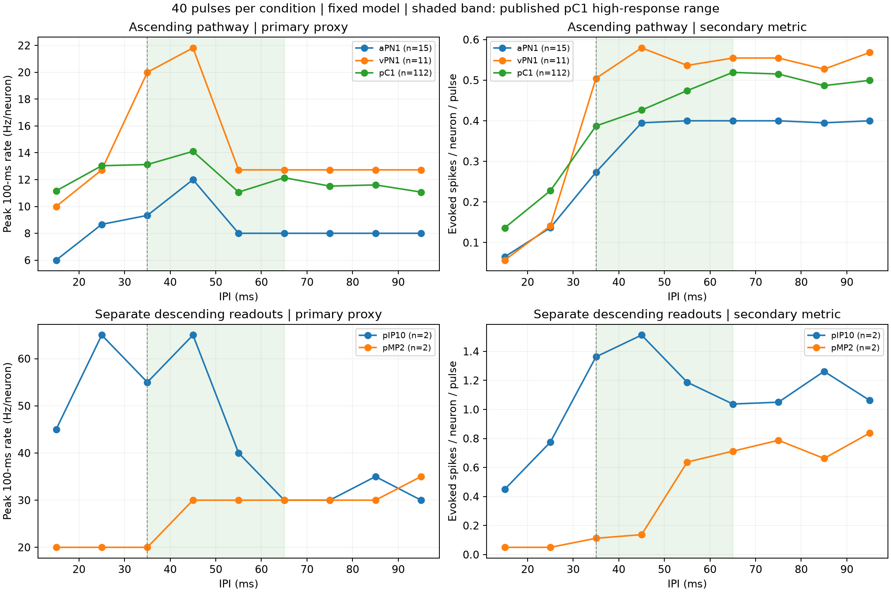
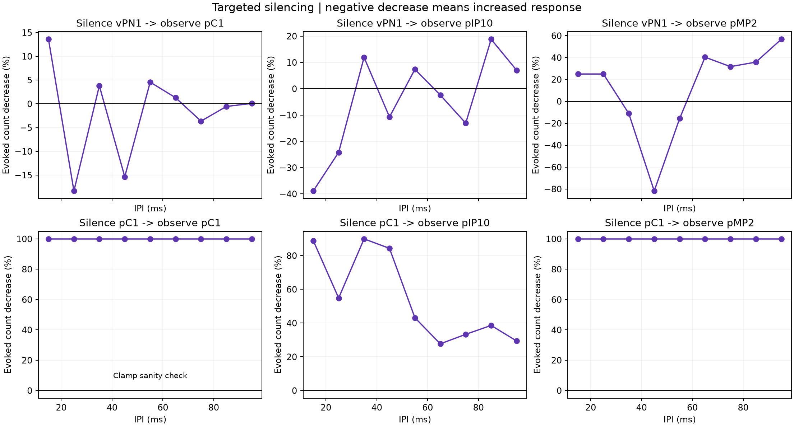
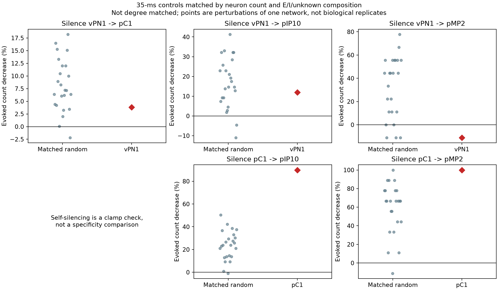

# 第四步：40 脉冲完整 IPI 验证（v1）

**结论：有条件支持：当前放电代理通过核心方向检查（CONDITIONAL_SUPPORT）。**

本次实验固定第三步模型参数，先保存协议、输入与代码哈希，再运行仿真。配置锁定时间：2026-09-18T03:19:29.853711+00:00。没有根据此次结果调整 gain、符号、阈值或验收规则。v0 的 16 项通过不是本次通过的先验依据。

## 预先固定的刺激与读出

- IPI：15、25、35、45、55、65、75、85、95 ms；每组 40 个脉冲，宽 3 ms、幅度 1.2、起始 100 ms。
- 所有试次时长均为 4308 ms；每次重置神经状态。响应区间为 [100 ms, 最后一个脉冲结束 + 500 ms)，具体时刻见 `stimulus_manifest.json`。各 IPI 的刺激持续时间不同，所有组输入的脉冲数和电流积分相同。
- 主读出为响应区间内完整 100 ms 滑窗的最大平均放电率（Hz/神经元）。分母包含群组内全部神经元。扣除对应静默试次后计算，不用不足 100 ms 的边缘窗口。
- 次读出为响应区间内扣除静默后的总放电数 / 神经元数 / 40，用于观察等脉冲数的整体响应与消融影响。另存刺激期间平均 Hz、响应尾端 Hz、相同试次窗口的总放电量，暴露窗口长度与持续活动的影响。
- 文献测量的是峰值钙信号 ΔF/F。100 ms 放电峰值是事先选定的工程代理，未经钙动力学校准；本次不计算与实验的 Pearson 相关系数或生物学显著性。

## 判据与结果

论文方向判据：vPN1 的 35 ms 响应高于 15 ms；pC1 的 35 ms 高于 15/25 ms，且高于 85/95 ms。不要求 35 ms 高于 55/65 ms，不再使用 20% 相对调制或 5 Hz 的任意生物学通过阈值。比较使用 1e-12 数值容差。

`engineering` 检查执行、夹断、信号/索引和输入一致性；`literature_proxy` 的主读出用于核心趋势检查；次读出用于补充对照。`causal_hypothesis` 检查 35 ms 时 vPN1 消融是否降低 pC1，是显式回路假设，不是直接行为复现。核心未通过项如下：

核心检查均通过；这仍不等于复现钙信号或 chaining 行为。

检查数不能作为生物学正确率：

| category | status | count |
| --- | --- | --- |
| causal_hypothesis | PASS | 1 |
| engineering | PASS | 11 |
| literature_proxy | FAIL | 1 |
| literature_proxy | PASS | 5 |
| scope | NOT_EVALUABLE | 2 |
| scope | PASS | 1 |

完整判据表见 `validation_checks.csv`，其中 `gate` 表示是否参与本次总结判定。

## 完整 IPI 曲线：主读出

| ipi_ms | aPN1 | pC1 | pIP10 | pMP2 | vPN1 |
| --- | --- | --- | --- | --- | --- |
| 15 | 6 | 11.16 | 45 | 20 | 10 |
| 25 | 8.667 | 13.04 | 65 | 20 | 12.73 |
| 35 | 9.333 | 13.12 | 55 | 20 | 20 |
| 45 | 12 | 14.11 | 65 | 30 | 21.82 |
| 55 | 8 | 11.07 | 40 | 30 | 12.73 |
| 65 | 8 | 12.14 | 30 | 30 | 12.73 |
| 75 | 8 | 11.52 | 30 | 30 | 12.73 |
| 85 | 8 | 11.61 | 35 | 30 | 12.73 |
| 95 | 8 | 11.07 | 30 | 35 | 12.73 |

## 定向消融与随机对照

消融钳制被选神经元的膜电位为复位值并禁止放电（包含外部输入）。其余细胞的权重与归一化分母不变。vPN1、pC1、听觉输入各跑完整 IPI 扫描。35 ms 时的次读出及其下降比例：

| target | group | baseline | ablated | drop_percent |
| --- | --- | --- | --- | --- |
| vPN1 | pC1 | 0.3873 | 0.3725 | 3.804 |
| vPN1 | pIP10 | 1.363 | 1.2 | 11.93 |
| vPN1 | pMP2 | 0.1125 | 0.125 | -11.11 |
| pC1 | pC1 | 0.3873 | 0 | 100 |
| pC1 | pIP10 | 1.363 | 0.1375 | 89.91 |
| pC1 | pMP2 | 0.1125 | 0 | 100 |
| auditory_input | pC1 | 0.3873 | 0 | 100 |
| auditory_input | pIP10 | 1.363 | 0 | 100 |
| auditory_input | pMP2 | 0.1125 | 0 | 100 |

下降比例为 `(完整 - 消融) / 完整`；负值表示响应增加。完整网络无响应时标为 N/A，不报告虚假的 0%/100%。被夹断群组自身归零是实现检查，不作为因果特异性证据。

每种 vPN1/pC1 消融各有 24 组随机对照，匹配神经元数和正/负/未知递质符号组成，排除所有观测群组。没有匹配度数、连接强度或基线放电活跃度；随机点是同一网络的不同扰动，不能当作独立动物重复或显著性证据。抽样种子和每组 bodyId 在运行前写入 `ablation_membership.json`。

| target | group | targeted_drop_percent | random_n | random_median_drop_percent | random_95th_percentile |
| --- | --- | --- | --- | --- | --- |
| vPN1 | pC1 | 3.804 | 24 | 7.176 | 16.3 |
| vPN1 | pIP10 | 11.93 | 24 | 16.06 | 32.89 |
| vPN1 | pMP2 | -11.11 | 24 | 44.44 | 65 |
| pC1 | pIP10 | 89.91 | 24 | 23.85 | 41.65 |
| pC1 | pMP2 | 100 | 24 | 66.67 | 88.89 |

## 输出解释与下一步

pIP10、pMP2 分开报告；合并值仅在数据表中标为 `output_combined_exploratory`，没有“必须在 35 ms 达峰”的门槛。旧警告对应的行为映射仍是未解决问题，并没有因修改检查分类而得到验证。详见 `output_readout_scope.json`。

若核心方向检查失败，结论是当前固定参数模型在该协议和放电代理下未获得相应支持，应保留失败曲线，先排查刺激到听觉神经元的映射、亚型异质性和突触/膜动力学，再设计独立版本及验证集。若核心检查通过，也仅支持基础回路假设；在论文复现或冻结最终硬件参考前，还需要实验量对应的观测模型或原始实验数据。此次结果不会自动开始第五步。

参考：[Zhou et al., eLife 2015](https://elifesciences.org/articles/08477)，Fig 5H、6K、6E；[Shiu et al., Nature 2024](https://doi.org/10.1038/s41586-024-07763-9)。递质符号是所选模型假设，未逐突触验证受体效应。

耗时：102.66 秒；所有来源、版本、阈值与执行语义见 `protocol_lock.json`、`run_metadata.json`。
