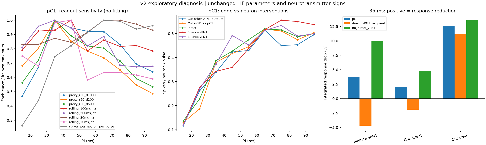
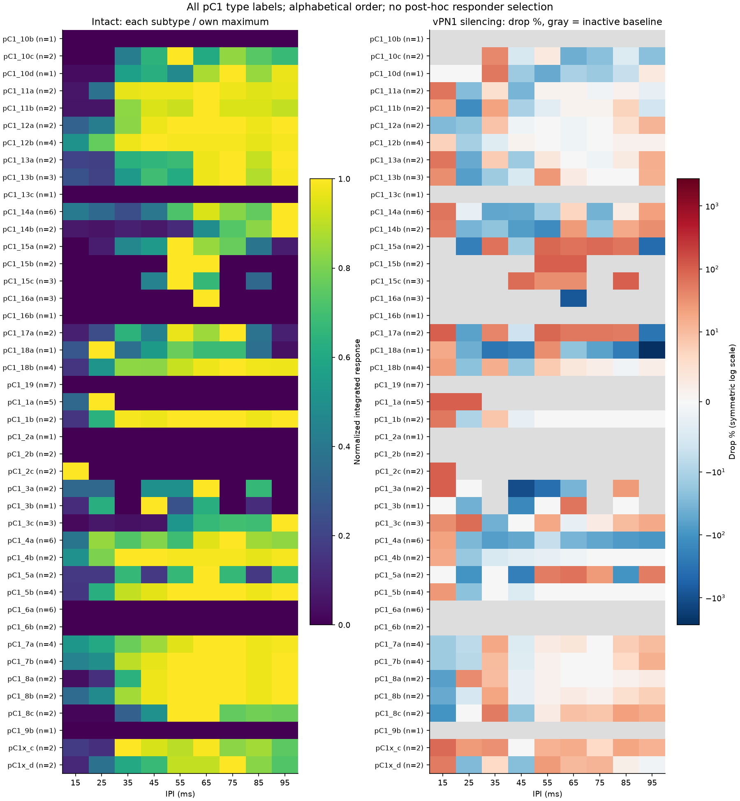

# v2 机制诊断与结果解读

**结论：诊断执行完成，但第四步尚不宜宣布生物学验证无保留通过，也不建议冻结最终 Golden Model。**

本轮解释 v1 的矛盾，不以调参消除警告。v1 的原始数据、自动结论与判据不变；本报告是看过 v1 后设计的探索性分析，不是独立验证。

## 1. 最重要的修正：不要把 vPN1 默认当作兴奋性串行中继

原始 MaleCNS 递质表与 IR 一致：11 个 vPN1 的 consensus_nt 均为 GABA，模型符号为 -1。单细胞预测置信度为 0.653–0.781；ground_truth 非空 0 个。这是数据集预测与建模约定，不是逐连接受体或电生理验证。

因此，v1 的“vPN1 消融应使 pC1 累计放电下降”只能是项目假设，不能用作未经条件限定的文献事实。直接抑制、间接作用、反馈都可能参与；行为受损也不等同于某一群体平均放电必然下降。保留递质符号，不为符合直觉而翻成兴奋性。

## 2. 真正执行的因果区分

把 vPN1 出边分成：A=到 pC1 的直接边，B=其余出边（包括可能的反馈相关边）。执行 A 切断、B 切断、A+B 切断，加上 aPN1 神经元消融；每种跑完整 9 个 IPI，共 36 次新刺激试次。其余权重完全不变，不重新归一化。

复用 18 次 v1 事件记录；另重跑 1 次完整网络核对，及 5 次静默检查。参考试次与 v1 spike event 逐项相同；A+B 切断在全部 9 个 IPI 下，对 vPN1 以外所有神经元产生与 vPN1 神经元消融完全相同的事件。

### 35 ms：pC1 定量结果

| condition_id | response_spikes | evoked_spikes_per_neuron_per_pulse | peak_rate_hz | drop_percent |
| --- | --- | --- | --- | --- |
| intact | 1735 | 0.38728 | 13.125 | 0 |
| silence_vPN1 | 1669 | 0.37254 | 15.179 | 3.804 |
| cut_vPN1_to_pC1 | 1701 | 0.37969 | 14.196 | 1.9597 |
| cut_vPN1_to_other | 1517 | 0.33862 | 15.089 | 12.565 |
| cut_vPN1_all_output | 1669 | 0.37254 | 15.179 | 3.804 |
| silence_aPN1 | 1534 | 0.34241 | 13.661 | 11.585 |

drop_percent 为正表示下降，为负表示增加。峰值与累计响应是不同问题，不能择优报告。

累计响应的 2×2 交互量 R(A+B)-R(A)-R(B)+R(intact)=0.0415179 spikes/neuron/pulse。非零交互表示网络非线性，不能简单把两个消融百分比相加，或把差值当作唯一的间接通路贡献。切直接抑制边也不保证全网络累计放电单调增加。

完整 IPI 扫描中，vPN1 消融使 pC1 累计响应在 5/9 个条件下降、4/9 个条件增加；这限制了统一的“正向中继必要性”解释。

## 3. pC1 群体混合与旁路

当前 pC1 包含 112 个神经元、43 个 type 标签。vPN1→pC1 有 99 条边、1069 个聚合突触，直接覆盖 38 个 pC1，仅占全部 pC1 入突触的 1.170%。这是解剖计数占比，不是有效电流或因果贡献占比。

删除 vPN1 后，112/112 个 pC1 仍存在从听觉输入出发、全正权重边的有向路径。它说明提取子图存在旁路，不证明这些路径在动物中被激活、占主导或解释了全部残余响应。路径逐细胞保存。

| group | neurons | condition_id | response_spikes | evoked_spikes_per_neuron_per_pulse |
| --- | --- | --- | --- | --- |
| pC1_direct_vPN1_recipient | 38 | intact | 726 | 0.47763 |
| pC1_no_direct_vPN1 | 74 | intact | 1009 | 0.34088 |
| pC1_direct_vPN1_recipient | 38 | silence_vPN1 | 760 | 0.5 |
| pC1_no_direct_vPN1 | 74 | silence_vPN1 | 909 | 0.30709 |
| pC1_direct_vPN1_recipient | 38 | cut_vPN1_to_pC1 | 740 | 0.48684 |
| pC1_no_direct_vPN1 | 74 | cut_vPN1_to_pC1 | 961 | 0.32466 |
| pC1_direct_vPN1_recipient | 38 | cut_vPN1_to_other | 645 | 0.42434 |
| pC1_no_direct_vPN1 | 74 | cut_vPN1_to_other | 872 | 0.29459 |

在 35 ms，43 个 type 标签中：基线活跃且 vPN1 消融后下降 17 个、增加 8 个；基线为零 16 个（百分比不可定义）。剩余为基线活跃但数值无变化。所有 type、fruDsx 标签分组、全部单细胞结果均导出，不事后挑选符合预期的亚型作为通过依据。

MaleCNS 的 type/fruDsx 标签不能自动等同于 2015 年实验驱动系和成像 ROI；目前没有建立这种精确映射。

## 4. 读出敏感性：峰值不等于累计量，更不等于 ΔF/F

固定检查 20/50/100/200 ms 峰值窗口、每脉冲累计量、三种双指数代理（rise=50 ms；decay=200/500/1000 ms）。代理的单 spike 核峰值归一为 1，单位为任意单位；参数仅用于工程敏感性分析，不是拟合的 GCaMP6m 时间常数。

下表 True 仅表示 35 ms 响应严格高于所列比较点；不是显著性、独立验证或新的生物学 PASS。

| metric | long_85_95 | short_15_25 |
| --- | --- | --- |
| proxy_r50_d1000 | True | True |
| proxy_r50_d200 | True | True |
| proxy_r50_d500 | True | True |
| rolling_100ms_hz | True | True |
| rolling_200ms_hz | True | True |
| rolling_20ms_hz | False | True |
| rolling_50ms_hz | True | True |
| spikes_per_neuron_per_pulse | False | True |

pC1 长 IPI 衰减在 6/8 个读出下成立；短、长两组方向同时成立 6/8。全部曲线均保留，没有选择最有利核函数来替换 v1 主读出。

实验本身测量峰值钙信号，并指出慢指示剂动力学、vPN1 胞体与 pC1 神经突起成像部位差异可能影响调谐。当前滤波只能检查结论对观测方式是否敏感，不能据此声称复现钙信号，也不能计算未经校准的实验相关系数。[Zhou et al., 2015](https://pmc.ncbi.nlm.nih.gov/articles/PMC4575990/)

## 5. 当前可接受的结论与下一步

- 工程侧：固定数据、浮点仿真、定向消融和复现检查可用。
- 生物学侧：存在 IPI 敏感性和网络因果效应，但串行兴奋性回路、强 vPN1 特异必要性、稳定 pC1 带通以及行为输出映射尚未得到充分支持。
- 当前代码更适合作为 **connectome-constrained 工程参考候选**，不是已经校准的行为预测模型。
- 后续优先建立实验驱动系/ROI 与 MaleCNS 亚型的可核查映射，并取得可用的实验数值约束；若引入细胞动力学或观测模型改动，另立版本、预先限定参数并保留独立刺激条件测试。不能只挑响应好的亚型或调整抑制符号。
- 本轮不开始第五步，不改第二、三步 IR/权重/神经元参数，也不把历史失败项改成通过。

## 复现与证据

v1 lock: `d3d0e82f3e88f6a7baa39b03a9b56157a2c642a2a0a9743e8690c71b493c02a6`；v2 lock: `f80de45cd615ce4602953e14b80fe855b03f045fa45a62229c64d941afb8250d`。全部旧输入及源文件哈希在运行前后核验一致。

- `vPN1_raw_nt_audit.csv`：原始递质字段、预测置信度、ground_truth 与 IR 对照。
- `edge_interventions.csv` / `simulation_integrity.csv`：切边与运行完整性。
- `response_summary.csv` / `intervention_effects.csv` / `factorial_interactions.csv`：完整消融与交互量。
- `pC1_connectivity.csv` / `pC1_single_cell_response.csv` / `pC1_subtype_connectivity.csv`：全部细胞、亚型、旁路。
- `pC1_offered_drive.csv`：按源符号分解的原始突触驱动总和；未考虑膜衰减和不应期丢弃，不是实际积分电流或因果贡献。
- `observation_sensitivity.csv` / `observation_directions.csv`：所有读出组合，包含响应窗后峰值标记。
- `population_activity/`：36 次新增仿真的完整 spike events。
- `artifact_sha256.json`：本轮生成文件的内容校验清单。

