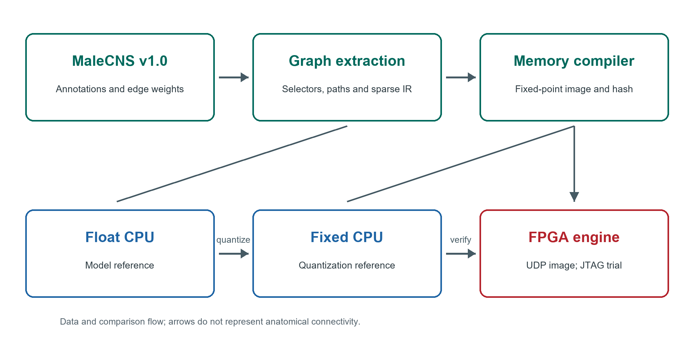
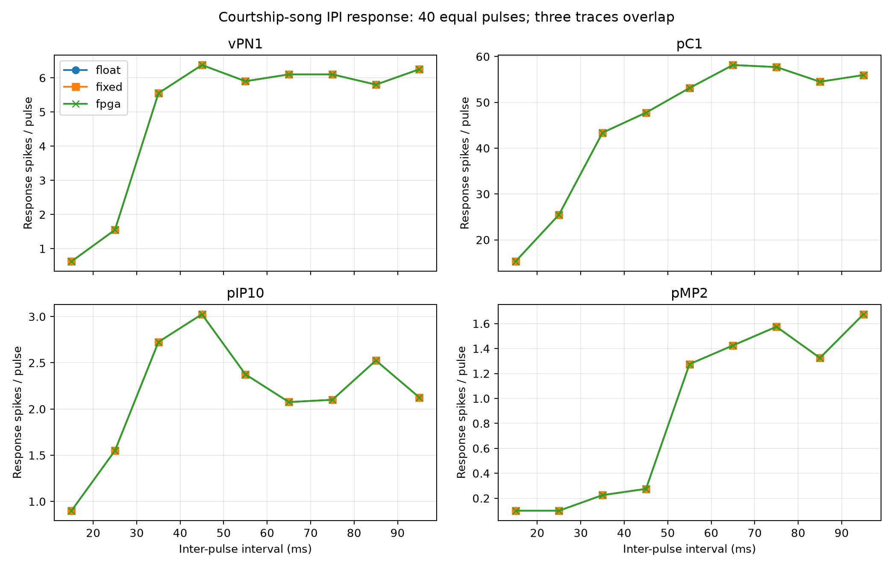
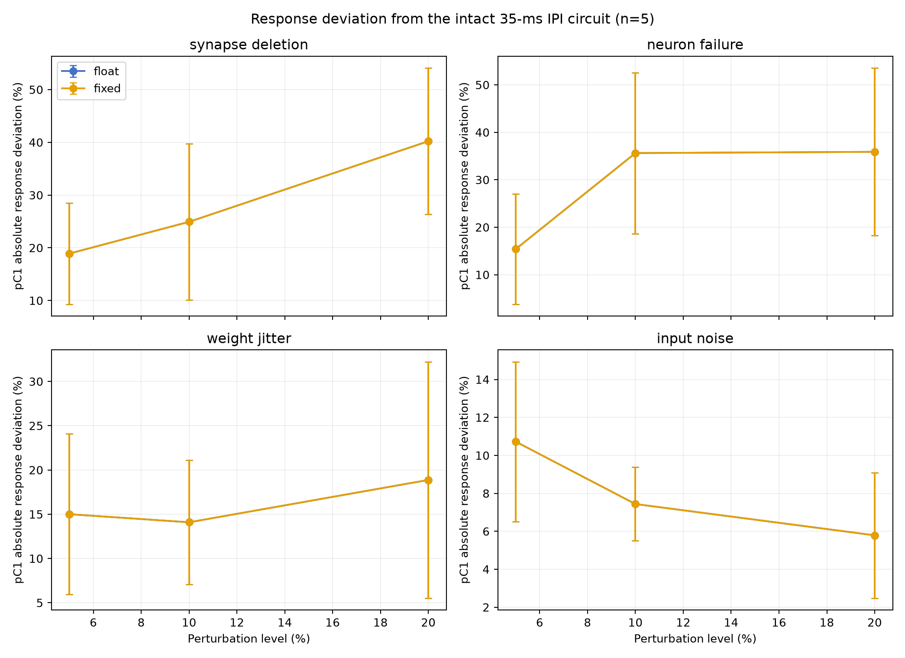
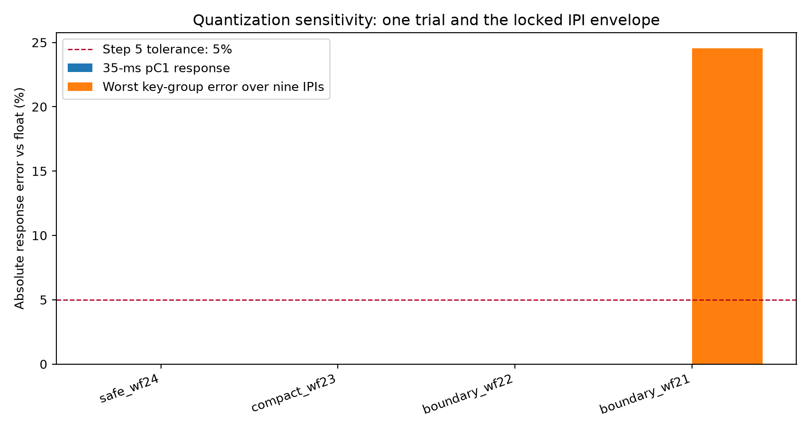
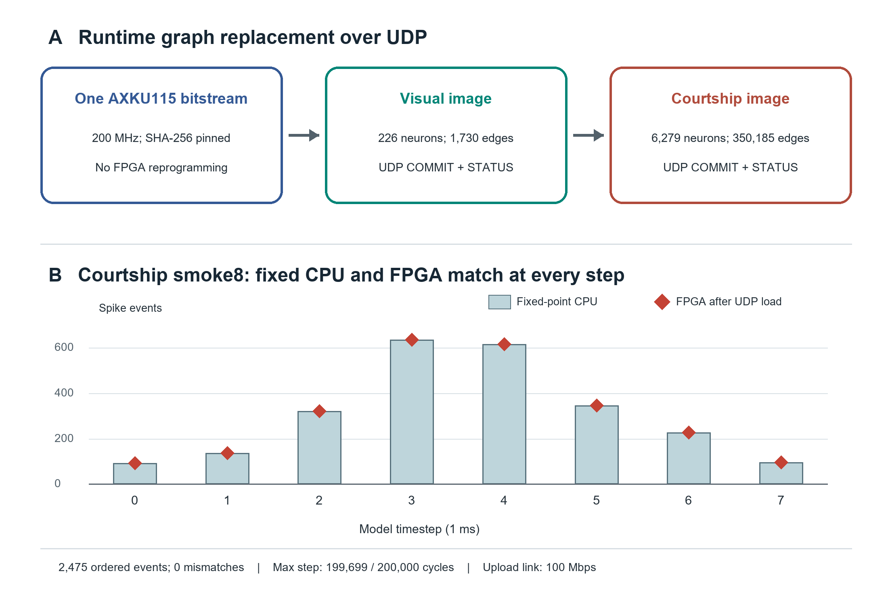
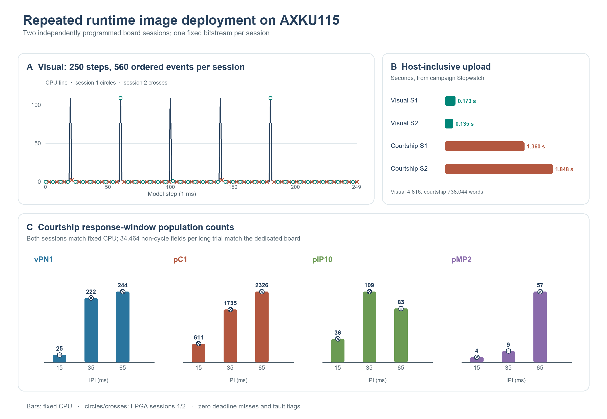
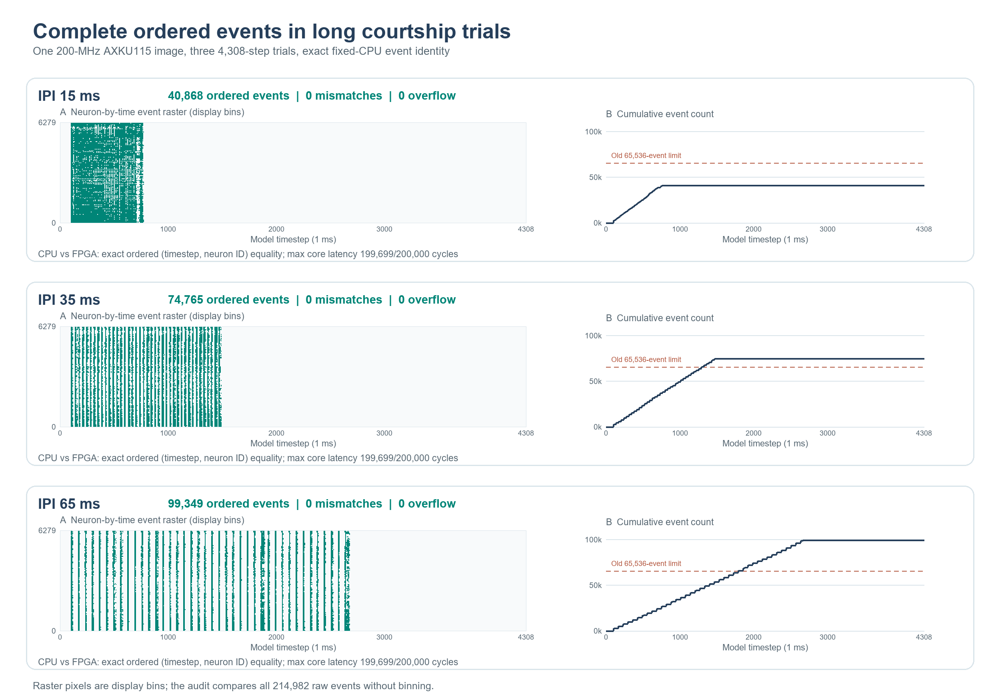
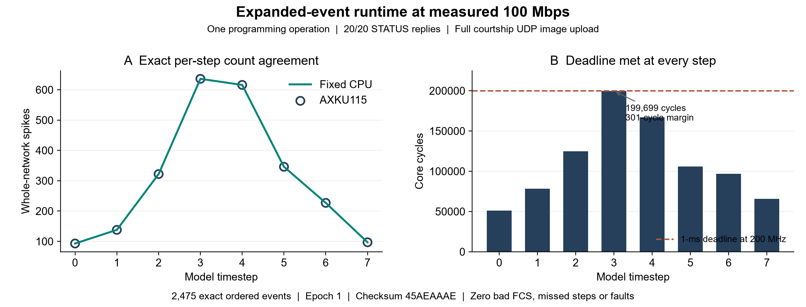
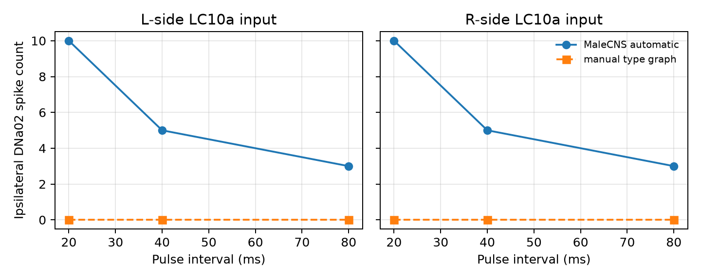

# CNS2FPGA Deploys MaleCNS Subcircuits by Runtime Image Replacement on an FPGA Neural Engine

Research manuscript, V0.3, revised 2 October 2026

## Abstract

The MaleCNS connectome provides neuron-resolved structural data for the adult male *Drosophila* central nervous system, but its synapse table is not itself an executable circuit. We built CNS2FPGA to extract path-constrained subgraphs, compile signed weighted connectivity into reproducible memory images, and execute a discrete-time leaky integrate-and-fire (LIF) model on a time-multiplexed FPGA. Its central deployment result is an AXKU115 runtime bitstream that accepts different neural-network images over UDP without FPGA resynthesis or reprogramming between images. In each of two independently programmed sessions, a 226-neuron/1,730-edge visual image produced all 560 expected ordered events in a 250-step trial, followed by a 6,279-neuron/350,185-edge courtship image producing all 2,475 expected ordered events in an eight-step trial. Three 4,308-step courtship conditions per session matched fixed-point CPU response-window population counts and the earlier dedicated FPGA's 34,464 per-step non-cycle fields per condition. A separately built 131,072-event-capacity runtime bitstream then captured all 40,868, 74,765, and 99,349 ordered individual events in those three long conditions; every event matched an independent fixed-point CPU reference in one successful board campaign. Both original-runtime sessions rejected incomplete and invalid uploads and recovered with a valid visual image; no deadline miss or diagnostic fault was observed. The worst courtship step was 199,699 of 200,000 available cycles. Host-inclusive image uploads took 0.135–0.173 s for visual and 1.360–1.848 s for courtship in the original-runtime campaign; a host readout showed a 1-Gbps link, without establishing line-rate throughput. The expanded-event image initially received no UDP ACK after programming and succeeded after the same bitstream was reprogrammed; these observations are reported separately. A JTAG runtime bitstream also passed physical two-image switching and fault recovery. Relative to the older dedicated courtship bitstream, the original Ethernet runtime bitstream preserved tested neural outputs but increased the worst core step by 636 cycles and routed LUT use from 11,912 to 32,422. These are engineering-output tests, not agreement with neural recordings or fly behavior.

An additional session on the same expanded-event bitstream at a measured 100 Mbps passed 20/20 STATUS probes, a complete courtship image upload, and 2,475 exact ordered events over eight steps with zero bad FCS. Subsequent 1-Gbps receive failures remain unresolved; further gigabit testing is deferred pending cable and link checks.

## Introduction

The MaleCNS v1.0 resource provides whole-central-nervous-system annotations and aggregate connection weights for male *Drosophila* [1, 2]. The data make it possible to ask how an annotated sensory-to-descending pathway behaves when its actual cell-to-cell connectivity is placed in an executable model. The biological inference is limited: a connectome does not specify postsynaptic receptor action, membrane parameters, an input transduction model, or a mapping from every experimental imaging region to a unique reconstructed cell. Consequently, our first target is an auditable engineering computation, not a complete simulation of a fly.

Existing experimental work identifies an auditory aPN1–vPN1–pC1 pathway relevant to courtship-song perception [3]. We use its annotated nodes and downstream candidates to stress a comparatively large graph. Work on visual object pursuit motivates a second path through LC10a, AOTU019/AOTU025, and DNa02 [4]. That graph tests whether the same extraction, numeric format, compiler, and neuron/synapse engine transfer to a different sensorimotor domain. We use synthetic current pulses rather than a reconstructed acoustic waveform or retinal image, so neither task is a behavioral prediction experiment.

Three comparisons define our evidence. Floating-point CPU versus fixed-point CPU isolates quantization. Fixed-point CPU versus RTL checks the entire virtual-neuron state under a short synchronous test. Fixed-point CPU versus the programmed FPGA checks observable events, counters, and deadlines in physical execution. We additionally test whether compiled graph images can be exchanged in the same programmed FPGA through a network loader. Keeping these levels separate prevents an exact hardware match from being mistaken for biological validation. We further compare a transparent type-level wiring baseline with the automatically extracted visual graph at a prespecified downstream output.

## Materials and methods

### MaleCNS source and circuit extraction

We pinned MaleCNS v1.0 annotation, neuron-level neurotransmitter prediction, and aggregate segment-to-segment connectivity Feather files from the official dataset [2]. Each extracted circuit records the source version and file hashes. Configuration selectors resolve named cell groups against the annotations. The extractor streams the weighted connectivity table, retains directed edges with at least five aggregate synapses, computes paths from selected input anchors to selected output anchors, and writes an indexed graph with contiguous sparse-row offsets, neuron and edge tables, anchor flags, and provenance metadata. Path selection is a graph operation; retained nodes are not asserted to be a uniquely defined biological circuit.

For courtship song, selected auditory anchors and annotated aPN1, vPN1, pC1, pIP10, and pMP2 groups produced 6,279 neurons, 350,185 directed weighted edges, and 7,029,800 aggregate synapses. Ninety-three cells received external current. For the visual transfer test, LC10a input anchors and AOTU019/AOTU025/DNa02 relays and outputs produced 226 neurons, 1,730 edges, and 33,748 aggregate synapses. Of 275 annotated LC10a cells, 220 satisfied the configured two-hop input-to-output path condition. The graph includes two AOTU019, two AOTU025, and two DNa02 cells. Its left-input variant keeps the same 226-neuron graph but marks only 109 left LC10a cells for stimulation. Both circuits are compiled by the same implementation with different configurations.

### Discrete time neural computation

The reference model advances in 1-ms steps. At each active-neuron update, the previous membrane voltage is multiplied by the decay factor exp(−1/20), then the external current and weighted spikes from the preceding timestep are added. The weighted input is the sum over presynaptic cells that fired in that preceding step. Threshold is 1, reset voltage is 0, bias current is 0, and a spike starts a two-step refractory counter. A neuron in refractory state or in an explicit silencing condition is held at reset. Each signed edge weight is the aggregate synapse count multiplied by the recurrent gain 0.015 and an engineering sign derived from the presynaptic transmitter prediction. Acetylcholine is assigned +1; GABA and glutamate are assigned −1; unknown or modulatory predictions contribute zero. The sign assignment is not a receptor-resolved physiological measurement.

The fixed-point reference reproduces specified rounding, saturation, refractory, and update order. The selected `safe_wf24` profile uses 34-bit state with 24 fractional bits, 30-bit weights with 24 fractional bits, 32-bit decay with 30 fractional bits, and a 35-bit accumulator. The graph compiler emits neuron parameters, synapse words, row offsets, transmitter-sign data, input mappings, and a global configuration image. It decodes and compares each serialized field in round-trip tests before use. The 226-neuron visual graph uses the courtship compiler and `safe_wf24` format unchanged.

### Hardware architecture and comparison hierarchy

The FPGA engine evaluates virtual neurons sequentially from on-chip memories and accumulates contributions from the preceding timestep's spikes. The board trial interface loads one signed 34-bit scalar input-current word per model step over JTAG AXI-Lite. Input-anchor flags determine which cells receive that word. The host reads summary counters, diagnostic flags, and ordered spike records when event memory permits. The original 65,536-event runtime image exported per-step group counts but not the full 74,765- and 99,349-event courtship trials. A separately built version increased event BRAM capacity to 131,072 entries; its three selected long trials, the short courtship raster, and the visual left-input trial have complete event readbacks in their respective tests. A JTAG host transfer is outside the measured neural-core timestep latency.

The runtime version retains this engine and adds a UDP/IPv4 loader over the AXKU115 RGMII port. A host preflights a compiled image, sends ordered 32-bit word blocks (at most 64 words per datagram), requests COMMIT, and then checks STATUS independently. The loader uses sequence numbers and ACKs to reject out-of-order or repeated writes; non-target UDP packets are drained without replies. The initial September 28 demonstration programmed this bitstream once for a visual-to-courtship sequence. Its visual wrapper's extra STATUS request used an incorrect sequence number and failed, but a corrected independent probe established image status 1 before courtship was uploaded. For the September 30 P0 campaign, we programmed the same SHA-256-pinned bitstream once in each of two separate sessions. In each session we loaded the visual image, ran 250 steps with full event capture, loaded courtship without reprogramming, ran an eight-step full-event test and 15-, 35-, and 65-ms IPI long trials, then tested interrupted and malformed uploads and recovery by reloading visual. We separately exercised the JTAG runtime bitstream with one programming operation, two image loads, and transport/invalid-image rejection. JTAG and UDP image transfers were never concurrent. Stopwatch upload durations include host software and UDP protocol, whereas JTAG control and host transfer are excluded from the reported neural-core step latency.

For a paired implementation comparison, we used the same frozen eight-step courtship `smoke8` stimulus and 200-MHz clock with the earlier dedicated courtship bitstream and the original Ethernet runtime bitstream. We compared each step's eight raw summary words by position, the complete ordered event-word files byte for byte, and the separate routed utilization and timing reports. Cycle count is summary word 0; an equal output event stream does not imply equal execution cycles, physical resources, or general equivalence under untested stimuli. The original paired comparison had one recorded short trial per implementation; the Ethernet side was subsequently repeated in the two P0 sessions. Each long P0 trial additionally compared response-window vPN1, pC1, pIP10, and pMP2 totals with fixed CPU and eight non-cycle parsed fields at each of 4,308 steps with the older dedicated-board capture. Those original P0 long trials did not record individual events. For the expanded-event bitstream, an independently generated fixed-point CPU event reference was compared with every ordered (timestep, neuron ID) pair, event start offset, per-step event count, seven other output/synapse fields, and fault/deadline flags in each long trial. Internal per-neuron voltage, current, and refractory states were not read back from either board image.

The RTL testbench compares voltage, synaptic current, refractory counter, and spike state for every visual neuron at each of eight steps. For each input image this is 226 × 8 × 4 = 7,232 field comparisons. The physical FPGA is checked against the fixed-point CPU at the recorded output interface, not by reading back all internal per-neuron states. A zero mismatch therefore has a deliberately different scope in RTL and on-board results.

### Stimulus and perturbation protocols

The courtship suite has nine equal-pulse inter-pulse intervals (IPI) of 15, 25, …, 95 ms, each with 40 pulses of 3-ms width at current amplitude 1.2. Two 35-ms-IPI conditions use amplitudes 0.8 and 1.4. One condition alternates 20- and 50-ms intervals, and a short 35-ms-IPI condition contains eight pulses for a complete board event raster. The long runs contain 4,308 steps; the short raster contains 350. The response window begins at 100 ms and ends at the trial-specific bound recorded in the protocol lock. We report raw window counts for exact implementation comparisons and divide by pulse count only for IPI response plots. The alternating sequence's last onset precedes the uniform 35-ms sequence's last onset by 15 ms; it is a pattern example, not a strictly duration-matched causal control.

The robustness suite holds the intact 35-ms, 40-pulse stimulus fixed. For each of four perturbation families—random synapse deletion, random neuron failure, Gaussian multiplicative weight jitter, and Gaussian scalar input noise—we used levels 5%, 10%, and 20% and five predetermined seeds per level. Together with the intact trial and four targeted ablations, this yields 65 full-length CPU trials. The perturbation statistic is the absolute difference between perturbed and intact response-window spike counts, divided by the intact count and multiplied by 100. Means and standard deviations across five seeds are descriptive, not confidence intervals. Three input-noise trials, one seed at each level, were also run on the earlier courtship FPGA implementation. This input noise is a common scalar per timestep, not independent noise for each of the 93 input cells. Graph-altering perturbations were CPU-only in that suite; the later runtime loader makes graph replacement possible but was not used to repeat those perturbation experiments.

For the visual circuit, CPU trials crossed 20-, 40-, and 80-ms pulse intervals with bilateral, left, and right LC10a input (nine 250-ms conditions). The board trial used the left-input image, 40-ms interval, 3-ms pulses, and amplitude 1.2. These are artificial current injections and do not encode object position, image motion, or visual feedback.

### Wiring baseline and numerical width sweep

The simplified visual baseline keeps the same 226 neuron IDs but replaces cell-to-cell edges with four complete-bipartite type rules: LC10a→AOTU019, LC10a→AOTU025, AOTU019→DNa02, and AOTU025→DNa02. Each synthetic edge receives the median synapse count of its corresponding real type pair. We compare ordered whole-network events and the prespecified DNa02_L/DNa02_R outputs. This baseline changes edge identity, number, degree, and total synaptic weight simultaneously; it cannot isolate one structural feature or measure manual mapping labor.

We evaluated four fixed-point profiles on the visual stimuli and an independent nine-IPI courtship width envelope. Selection of `safe_wf24` for the reported bitstreams preceded the final board comparison. We call a format acceptable in the courtship envelope only if the configured key-response error is within the 5% criterion and saturation constraints pass. An exact match at one stimulus is insufficient to accept a format over the full interval sweep.

### Data recording and reproducibility

The source tables, selection configurations, intermediate graphs, memory images, CPU traces, board captures, Vivado timing/utilization reports, and protocol-lock hashes are retained in the project workspace. Table values and plotted coordinates in this paper are copied from the machine-readable files listed in the accompanying data manifest. The P0 audit re-runs the frozen trial validators on raw captures and compares the two original-runtime session files and bitstream hashes. A separate audit independently rechecks all 214,982 long-trial events captured on the expanded-event bitstream against fixed CPU and preserves the first-program Ethernet timeout as a failed attempt. The two original-runtime sessions and the one successful expanded-event campaign used the same physical board, not independent laboratories or boards. No external power meter or experimental fly response dataset was used for the claims below.

*Figure 1. MaleCNS source tables feed path-constrained extraction and a fixed-point memory compiler. A runtime image may be loaded into the programmed FPGA over UDP; JTAG controls the recorded trials. The floating CPU, fixed CPU, RTL, and FPGA occupy distinct verification levels. Arrows describe data and comparison flow, not anatomical connectivity.*

## Results

### Extracted graph and memory footprint

The courtship candidate is 27.8 times larger than the visual candidate by neuron count and 202.4 times larger by directed edge count (Table 1). The serialized courtship logical image contains 23,518,944 bits and the visual bilateral image 154,528 bits. These are compiler-image bits, not physical block-RAM utilization. Even dividing visual image bits by 36,864 gives only a five-BRAM36 aggregate-capacity lower bound; allocating individual files separately gives a nine-BRAM36 lower bound before access ports, state, buffering, and placement. The measured implementations use substantially more physical RAM for those additional structures.

Table 1. Extracted graph and logical memory size

| Measure | Courtship song | Visual to steering |
| --- | ---: | ---: |
| Retained neurons | 6,279 | 226 |
| Directed weighted edges | 350,185 | 1,730 |
| Aggregate synapse count | 7,029,800 | 33,748 |
| Stimulated input cells | 93 | 220 bilateral or 109 left |
| Compiled logical image bits | 23,518,944 | 154,528 bilateral; 152,752 left |

### Courtship computation and physical deadline

All 13 courtship conditions matched between floating and fixed CPU at the ordered individual-event level. On the board, all measured per-timestep population counts matched fixed CPU in the long conditions; the eight-pulse raster additionally matched ordered individual events. A later expanded-event board image also matched every ordered individual event in the 15-, 35-, and 65-ms IPI long conditions (Figure 9), but not the other long conditions. The 40-pulse pC1 response-window count rose from 611 at 15 ms IPI to 2,326 at 65 ms and then was 2,238 at 95 ms (Table 2, Figure 2). These are model spike counts under differently timed windows, not a fit to the pC1 calcium or behavioral tuning curve in [3]. The Figure 2 y-axis divides each count by 40 pulses to show the event-normalized response without implying a measured neural firing rate.

Table 2. Courtship pC1 response-window spikes for 40 equal pulses

| IPI ms | Float CPU | Fixed CPU | FPGA | Spikes per pulse |
| ---: | ---: | ---: | ---: | ---: |
| 15 | 611 | 611 | 611 | 15.275 |
| 25 | 1,020 | 1,020 | 1,020 | 25.500 |
| 35 | 1,735 | 1,735 | 1,735 | 43.375 |
| 45 | 1,910 | 1,910 | 1,910 | 47.750 |
| 55 | 2,125 | 2,125 | 2,125 | 53.125 |
| 65 | 2,326 | 2,326 | 2,326 | 58.150 |
| 75 | 2,308 | 2,308 | 2,308 | 57.700 |
| 85 | 2,180 | 2,180 | 2,180 | 54.500 |
| 95 | 2,238 | 2,238 | 2,238 | 55.950 |

*Figure 2. Model response-window spikes per input pulse for vPN1, pC1, pIP10, and pMP2 across nine IPIs. CPU float, CPU fixed, and FPGA traces overlap at the plotted group counts. The FPGA comparison is per-millisecond population count, while float/fixed also matched ordered individual events. Longer IPIs have later response-window ends by protocol; curve shape must not be interpreted as measured fly tuning.*

*Figure 3. Full individual-event raster for the 350-ms, eight-pulse courtship trial. CPU float, CPU fixed, and FPGA output agree on the ordered event sequence. The original runtime P0 long trials were verified through per-step group counts because their event capture was disabled; a separate expanded-event bitstream later captured three complete long sequences (Figure 9).*

The placed-and-routed courtship implementation met 200-MHz timing with +0.073 ns setup worst negative slack (WNS) and +0.030 ns hold worst hold slack (WHS). It consumed 11,912 LUTs, 4,093 flip-flops, 589 RAMB36, three RAMB18, and four DSPs (Table 3). The slowest observed step took 199,063 cycles, or 995.315 µs. The one-millisecond deadline is 200,000 cycles, leaving only 937 cycles (4.685 µs). This demonstrates real-time operation for the recorded cases but leaves little runtime margin for a larger graph or additional logic at the same clock and architecture. Core synaptic-operation rates in the 13 cases span approximately 2.94–11.48 million operations per execution second, excluding JTAG transfer. We do not report power or energy efficiency.

### Courtship perturbation and precision envelope

Across 65 complete CPU trials, floating and fixed references had zero response-window count difference in the key recorded groups. Figure 4 shows pC1 absolute deviation from the intact model under each random perturbation, averaged across five seeds. At 20% synapse deletion the mean deviation was 40.21% (standard deviation 13.88%); at 20% neuron failure it was 35.88% (17.65%); at 20% weight jitter it was 18.87% (13.34%). Input-noise deviations were 10.72%, 7.44%, and 5.79% at 5%, 10%, and 20%, respectively. That non-monotone pattern is an observation from five draws per level and a windowed spike-count statistic, not evidence that more noise improves biological robustness. Four targeted ablations were analyzed separately in the source tables.

*Figure 4. Absolute pC1 response-window count deviation from the intact 35-ms-IPI model. Points are means and bars are descriptive standard deviations over five predetermined seeds per level. Float and fixed series overlap. Deviation is a model sensitivity statistic, not behavioral task accuracy or a confidence interval. Synapse deletion, neuron failure, and weight jitter were simulated on CPU only.*

Three common-input-noise trials ran on the courtship bitstream. For 5%, 10%, and 20% noise (one seed each), 77,544 neuron-group-by-timestep count comparisons between fixed CPU and FPGA had zero mismatches and no reported saturation, overflow, or deadline diagnostic. This result establishes board fidelity under the tested scalar input noise; it says nothing about board execution of the graph-altering perturbations.

The independent nine-IPI width envelope selected `safe_wf24` conservatively (Table 4). `safe_wf24`, `compact_wf23`, and `boundary_wf22` had zero maximum key-response error in that sweep, whereas `boundary_wf21` reached 24.53% and failed the 5% acceptance rule. The narrowest format could still match a selected 35-ms test exactly; hence a single-condition exact-event result cannot replace the wider envelope.

Table 3. Placed and routed AXKU115 implementations at 200 MHz; runtime measurements use the eight-step courtship smoke test, whereas the first two columns summarize earlier dedicated implementations

| Hardware measure | Dedicated courtship | Dedicated visual left | Runtime Ethernet, courtship loaded |
| --- | ---: | ---: | ---: |
| LUT | 11,912 | 3,008 | 32,422 |
| Flip-flop | 4,093 | 3,602 | 11,670 |
| RAMB36 | 589 | 88 | 592 |
| RAMB18 | 3 | 9 | 6 |
| DSP | 4 | 4 | 4 |
| Setup WNS ns | +0.073 | +0.191 | +0.012 |
| Hold WHS ns | +0.030 | +0.028 | +0.010 |
| Maximum measured step cycles | 199,063 | 4,439 | 199,699 |
| Maximum measured step µs | 995.315 | 22.195 | 998.495 |
| Slack against 1-ms step cycles | 937 | 195,561 | 301 |

Table 4. Nine-IPI courtship fixed-point width envelope

| Format | State bits | Weight bits | Accumulator bits | Maximum key-response error | Acceptance |
| --- | ---: | ---: | ---: | ---: | --- |
| safe_wf24 | 34 | 30 | 35 | 0.00% | Pass |
| compact_wf23 | 33 | 29 | 33 | 0.00% | Pass |
| boundary_wf22 | 33 | 28 | 32 | 0.00% | Pass |
| boundary_wf21 | 33 | 27 | 31 | 24.53% | Fail |

*Figure 5. Maximum key-response error across nine courtship IPI conditions for four fixed-point formats. The 5% criterion applies to the complete envelope. No state saturation was recorded in this table; `boundary_wf21` fails because its response error exceeds the criterion.*

### Transfer to a visual to steering candidate pathway

The visual graph passed all eight compiler round-trip checks. In the eight-step RTL tests, bilateral and left-only images each passed 7,232 full-state/spike comparisons without an error; the board-oriented RTL core independently passed the left-input comparison. Across nine 250-ms CPU conditions, float and fixed individual events matched exactly without saturation. With a 40-ms IPI, left LC10a input produced five DNa02_L and zero DNa02_R spikes; right input produced the mirror response. Bilateral synchronous input produced no DNa02 spikes. We report these as outputs of the selected graph and current-injection model, not a steering direction or heading change.

The earlier left-input image was placed and routed as a separate KU115 bitstream, because the scalar board input broadcasts to all cells flagged as input anchors. The image retains both DNa02 cells and the same synapse graph. Its 200-MHz implementation passed setup and hold timing (+0.191 and +0.028 ns), with zero unrouted or partially routed nets and zero DRC errors. In the 250-step 40-ms-IPI trial, all 560 ordered individual spike events and all 250 total-spike step counts matched fixed CPU. The observed DNa02_L/DNa02_R counts were 5/0. Maximum core latency was 4,439 cycles (22.195 µs), with zero deadline misses, saturation diagnostics, or event overflow. Physical resources are in Table 3. This trial was later repeated on the Ethernet runtime bitstream in the P0 campaign (Figure 8); its 4,548-cycle maximum is a paired implementation difference, not a graph-scaling law.

### Single-bitstream neural-network replacement over Ethernet

The final routed runtime bitstream targets `xcku115-flva1517-2-i` and has SHA-256 `581354A62C8C7AEB134F300E7EA1928D8B681B996807710C61E307B33530D8F8`. At 200 MHz it passed routed setup (+0.012 ns), hold (+0.010 ns), routing (zero unrouted nets), and DRC (zero errors). Its resource use is shown in Table 3. The initial September 28 uploads negotiated 100 Mbps and did not record host-inclusive timing. During the separate September 30 P0 campaign a read-only host-adapter query reported a 1-Gbps negotiated link; the measured uploader durations below do not establish line-rate throughput or continuous link-speed monitoring.

With the FPGA configuration unchanged, the host first transmitted the visual left-input image (4,816 words in 81 data packets; 226 neurons, 1,730 edges), receiving a successful COMMIT for checksum `6C233D31`. A separate STATUS probe with the corrected sequence number confirmed image status 1. The host then transmitted the courtship image (738,044 words in 11,538 data packets; 6,279 neurons, 350,185 edges), receiving a successful COMMIT for checksum `45AEAAAE` and an independent status-1 reply. The visual wrapper's earlier extra probe failed solely at the sequence-number check; its log is preserved rather than relabeled as a clean full-script pass. Both images were accepted by one programmed bitstream, with no resynthesis or FPGA reprogramming between them (Figure 7).

After the initial courtship load, JTAG readback reported active neuron and edge counts 6,279 and 350,185, image status 1, checksum `45AEAAAE`, epoch 2, and zero missed steps. In the eight-step `smoke8` board trial, all eight per-step spike counts and the complete 2,475-event ordered raster matched the fixed-point CPU reference. The maximum core step took 199,699 cycles (998.495 µs), leaving 301 cycles (1.505 µs) against the 1-ms deadline; no summary fault flags were set. This September 28 result was a short functional check; the distinct September 30 P0 trials below expand its scope.

*Figure 7. Initial September 28 graph replacement on one programmed AXKU115 bitstream (A). The courtship image was executed for eight 1-ms steps; fixed-point CPU bars and FPGA diamond markers agree at every step, and all 2,475 ordered events agree (B). The initial visual image was only committed and status-checked; subsequent full visual and long courtship trials are shown in Figure 8. The initial upload link negotiated 100 Mbps.*

### Repeated full-trial and fault-recovery validation on physical AXKU115

The September 30 P0 campaign independently programmed the same SHA-256-pinned Ethernet runtime bitstream once in each of two sessions. Within each session, visual and courtship image changes and the later recovery were data transfers, not FPGA programming operations. The visual image committed at epoch 1 (`6C233D31`), and a complete 250-step trial matched all 250 fixed-CPU step counts and 560 ordered events. Courtship then committed at epoch 2 (`45AEAAAE`); its eight-step trial matched all 2,475 ordered events. Both sessions recorded the same 4,548-cycle visual and 199,699-cycle courtship maximum core steps, with zero missed deadlines and fault flags. Recovery reloaded visual at epoch 3 and again matched 560 ordered events over 250 steps. The event-word files and every summary word in the corresponding trials were byte-identical between sessions.

Three 4,308-step courtship conditions (15, 35, and 65 ms IPI) were then run in each session without changing the bitstream or reloading the courtship image. The vPN1, pC1, pIP10, and pMP2 response-window totals matched the frozen fixed-point CPU for all six board trials (Table 6; Figure 8). At every step, eight parsed non-cycle fields—total, aPN1, vPN1, pC1, pIP10, pMP2, event count, and flags—also matched the earlier dedicated-board capture: 34,464 compared fields per trial. The complete 34,464-word summary files were byte-identical between P0 sessions for each IPI. Relative to the dedicated implementation, core cycle counts differed in 642, 721, and 701 steps for IPI 15, 35, and 65 ms, respectively, with a maximum absolute difference of 636 cycles. All three P0 trial types had a 199,699-cycle maximum and zero deadline misses, state saturation, accumulator saturation, or event overflow. Full individual-event rasters were not captured for these long trials; `events=0` in their raw runner log means event capture was disabled, not that the network generated no spikes.

Table 6. Response-window courtship counts in each fixed-CPU reference and both Ethernet FPGA sessions (all three values equal for every entry)

| IPI (ms) | vPN1 | pC1 | pIP10 | pMP2 | Steps/session |
| ---: | ---: | ---: | ---: | ---: | ---: |
| 15 | 25 | 611 | 36 | 4 | 4,308 |
| 35 | 222 | 1,735 | 109 | 9 | 4,308 |
| 65 | 244 | 2,326 | 83 | 57 | 4,308 |

In each session, a deliberately interrupted partial UDP upload left the image loader incomplete; COMMIT rejected it with image status `0x16`. An invalid postsynaptic index was separately rejected with status `0x66`. After these negative tests, a valid visual reload restored image status 1 and the full visual trial passed. The companion JTAG runtime bitstream (SHA-256 `95F9B50EE03804DDC211828A9FBD3B3171B45BC3FFB79F9F3B2407F0D3190E52`) was programmed once, then accepted visual and courtship images with 560 and 2,475 matching ordered events. Its interrupted load, incomplete COMMIT, invalid postsynaptic index, and valid visual recovery passed separately; the final JTAG recovery reached epoch 4. These tests establish bounded protocol rejection and recovery for the injected faults, not exhaustive fault tolerance.

Host-inclusive UDP uploader times were 0.173 and 0.135 s for the 4,816-word visual image, and 1.360 and 1.848 s for the 738,044-word courtship image in sessions 1 and 2, respectively. These are two descriptive observations, not a throughput distribution or a pure wire-speed measurement; they exclude FPGA programming and neural trial/JTAG readback time. The different link-speed observations for the earlier and P0 runs are reported separately rather than pooled.

*Figure 8. P0 validation in two independently programmed sessions using the same Ethernet runtime bitstream. (A) Complete visual CPU trace; sampled markers distinguish the two board sessions, which matched all 250 step counts and 560 ordered events each. (B) Host-inclusive visual and courtship UDP upload elapsed times. (C) Four courtship response-window population counts under three 4,308-step IPI conditions; bars are fixed CPU, circle/cross overlays are board sessions 1/2. Each group uses its own vertical scale. The long-trial evidence is group-count and per-step-summary agreement, not full individual-event agreement.*

### Expanded-event bitstream and complete long-trial identity

The 65,536-entry event store in the original runtime image could accommodate the 40,868 events of the 15-ms IPI trial but not the 74,765 and 99,349 events of the 35- and 65-ms trials. We first enabled full event capture on the original image for the 15-ms condition: all 40,868 ordered events matched an independent fixed-point CPU reference and all 4,308 per-step total, group, and synapse-operation values matched the earlier dedicated-board capture. We then doubled the RTL event store to 131,072 entries without changing the graph image, neuron arithmetic, stimulus, or 200-MHz clock. The resulting Ethernet runtime bitstream has SHA-256 `D4C9378D461147062FA5DC590CB3647D241C789B01CC6255F38DA16CB21990DF`. Its routed implementation used 618/2,160 BRAM36 tiles, 26 more than the original Ethernet runtime's 592, and passed setup (+0.008 ns), hold (+0.030 ns), routing, and DRC signoff.

The first programming of this expanded-event bitstream showed a 1-Gbps physical link but no UDP ACK; JTAG diagnostics recorded 547 bad-FCS frames and no valid received frames. A temporary static ARP neighbor did not restore a STATUS reply. Reprogramming the same bitstream once restored UDP STATUS and enabled a successful 738,044-word courtship-image COMMIT (`45AEAAAE`). The three long tests below then ran without further FPGA programming or image replacement. This is one successful expanded-event board campaign after one failed first-program Ethernet attempt; it does not establish power-on reliability or a repeatable upload-time distribution.

All three 4,308-step trials matched the fixed-point CPU's complete ordered (timestep, neuron ID) sequence with zero event mismatches (Table 7; Figure 9). The 15-ms event-word and raw summary files were byte-identical between the original and expanded runtime captures. For all three conditions, 30,156 per-step total, group, and synapse-operation fields also matched the earlier dedicated-board capture; event-start offsets were contiguous, each captured event count equaled that step's total spikes, and no overflow, diagnostic fault, or missed deadline occurred. Each trial's maximum core latency was 199,699/200,000 cycles. Full event parity is now established for these three selected long stimuli on one board and one successful expanded-event programming state; it does not imply internal-state readback or agreement with biological recordings.

Table 7. Complete long-trial ordered-event validation on the expanded-event Ethernet runtime bitstream

| IPI (ms) | Steps | Ordered events CPU = FPGA | Event mismatches | Overflow or missed steps |
| ---: | ---: | ---: | ---: | ---: |
| 15 | 4,308 | 40,868 | 0 | 0 |
| 35 | 4,308 | 74,765 | 0 | 0 |
| 65 | 4,308 | 99,349 | 0 | 0 |

*Figure 9. Three complete 4,308-step courtship trials on the expanded-event runtime image. Left: binned neuron-by-time event raster for display only. Right: cumulative raw event counts; the dashed line marks the prior 65,536-event BRAM limit crossed by the 35- and 65-ms trials. The audit compares all 214,982 raw ordered events without binning against independently generated fixed-point CPU references and reports zero mismatches, overflows, or missed steps. This is one successful board campaign, not a second independent-board replication.*

### Speed controlled validation of the expanded event image

On October 1, the same expanded-event bitstream was programmed once with a measured 100 Mbps full-duplex link. All 20/20 repeated read-only STATUS probes replied on their first attempt. The complete courtship graph uploaded as 738,044 words in 11,538 protocol packets and committed with checksum `45AEAAAE`; a subsequent correctly sequenced STATUS confirmed image readiness. The eight-step courtship trial matched all eight fixed-CPU spike counts and all 2,475 ordered events at epoch 1, with a maximum core latency of 199,699 cycles and zero missed steps or fault flags (Figure 10). The post-trial MAC bad-FCS count was zero. The host's original IP and NIC speed setting were restored afterwards. This is one additional passing 100-Mbps programming session, not a repeated cold-start test or a rerun of the three long conditions at a controlled 100-Mbps rate.

The prior first-program failure was followed by two failed JTAG configurations and one failed configuration after a user-reported full power cycle. In these three later sessions the MAC indicated 1 Gbps, reported 365, 370, and 354 bad-FCS frames, respectively, and no valid receive frames. These were separate probes, not a random sample from which to estimate a failure probability. The original runtime had previously received valid frames with zero bad FCS while the host reported 1 Gbps. Thus gigabit operation is historically observed but its reliability is not established for the expanded image. The new 100-Mbps result narrows the problem to receive integrity under the failed conditions rather than locating its physical cause.

The PHY's RGMII pad-skew settings read as the documented defaults. At 1 Gbps its RX clock is 125 MHz, versus 25 MHz at 100 Mbps [5]. Both existing routed checkpoints met the modeled receive-input timing constraints; the expanded image's worst reported input hold slack was +0.668 ns. However, the fixed 400-tap IDELAYE3 COUNT setting is uncalibrated and has no voltage or temperature compensation [6], and static timing does not measure the PHY/PCB data eye. Separately, the host subsequently reported an actual 100-Mbps link despite a driver setting of 1 Gbps full duplex. Cable capability, connector/NIC/PHY behavior, and FPGA RGMII sampling remain candidate explanations. The cable has not been independently qualified for gigabit operation. Further 1-Gbps tests are deferred pending a controlled cable/link check; neither a cable fault nor a timing fix is claimed here.

*Figure 10. Additional speed-controlled trial on the same expanded-event bitstream at an actual 100-Mbps link. (A) Fixed-CPU and board whole-network spike counts coincide at all eight steps; a separate raw-event audit matched all 2,475 ordered events. (B) Core step cycles remain below the 200,000-cycle deadline, with a 301-cycle minimum margin. The recorded session also passed 20/20 STATUS probes and a complete courtship UDP image upload, with zero post-trial bad FCS. These results describe one eight-step session and do not establish 1-Gbps reliability or long-trial performance at 100 Mbps.*

### Paired old and new courtship bitstream comparison

The dedicated and Ethernet-runtime `smoke8` event-word files are byte-identical (2,475 ordered events; SHA-256 `2B3A10A3F2CF9543E40CB0E65042DDF6C1E74E060EE286E4BB146627B25F6E0D`). At every step, the other seven 32-bit summary words also match exactly. Only summary word 0, the core cycle count, differs (Table 5). The runtime bitstream adds 93, 138, 322, 636, 616, 346, 227, and 97 cycles across steps 0–7, respectively; each observed increment equals that step's spike count. This numerical relationship does not by itself identify a causal RTL mechanism. The maximum increase is 636 cycles (0.32% of the dedicated maximum), reducing the one-millisecond margin from 937 to 301 cycles without causing a deadline miss.

Table 5. Paired eight-step courtship board capture: output counts unchanged, core cycles increased on the Ethernet runtime bitstream

| Step | Spikes in both | Dedicated cycles | Ethernet runtime cycles | Added cycles |
| ---: | ---: | ---: | ---: | ---: |
| 0 | 93 | 51,013 | 51,106 | 93 |
| 1 | 138 | 78,166 | 78,304 | 138 |
| 2 | 322 | 124,591 | 124,913 | 322 |
| 3 | 636 | 199,063 | 199,699 | 636 |
| 4 | 616 | 166,432 | 167,048 | 616 |
| 5 | 346 | 105,691 | 106,037 | 346 |
| 6 | 227 | 96,541 | 96,768 | 227 |
| 7 | 97 | 65,470 | 65,567 | 97 |

The hardware footprints differ as well (Table 3). Relative to the dedicated courtship bitstream, the Ethernet runtime bitstream uses 20,510 more LUTs, 7,577 more flip-flops, three more RAMB36, and three more RAMB18; DSP use remains four. Routed setup WNS decreases from +0.073 to +0.012 ns. These differences reflect a changed overall implementation, including runtime image storage/control and the network loader, and are not an isolated measure of Ethernet logic alone. They show that preserving the tested neural output did not preserve hardware cost or timing. The dedicated visual bitstream is smaller still, but its 226-neuron graph and different stimulus make its resource and latency figures unsuitable as a paired courtship comparison.

### Type level wiring baseline exposes an output specific difference

The four-rule type graph contains 888 synthetic directed edges and 59,612 synthetic aggregate synapses. Only 321 edge pairs overlap the 1,730-edge MaleCNS graph, yielding edge Jaccard 0.1397. Under bilateral 40-ms input both graphs produce zero DNa02 spikes, which would appear to be agreement if only that input were used. Under left-only input, the extracted graph produces five DNa02_L spikes but the simplified graph produces none; the right condition is symmetric. At 20, 40, and 80 ms IPIs the extracted graph has 10, 5, and 3 ipsilateral DNa02 spikes, respectively, versus zero in the simplified graph (Figure 6). The whole-network ordered-event F1 remains about 0.987 in unilateral trials because LC10a input spikes dominate the event count. The output-specific comparison therefore detects a difference obscured by a global agreement score.

*Figure 6. Ipsilateral DNa02 response to unilateral LC10a current pulses in the extracted graph and four-rule simplified type graph. Both graphs use the same neuron IDs but different edges and weights. The figure establishes a model-output difference under this unmatched baseline, not a causal attribution to one graph feature or a measured fly steering response.*

Four width profiles had exact float/fixed event agreement and zero saturation across the tested visual pulse and sustained-drive conditions. This task-specific tolerance does not make the narrowest format safe in the larger courtship graph; the courtship width envelope rejects it. More generally, the exact hardware matches in this section attest to implementation of the reference computation, not to the correctness of that computation as a neural or behavioral model.

## Discussion

This study demonstrates a reproducible route from a pinned connectome release to a physical, time-multiplexed neural engine. Its principal deployment contribution is separation of FPGA hardware compilation from graph deployment: the same bitstream accepted two very different compiled network images through a network port without reprogramming between images. Two independently programmed original-runtime sessions reproduce full visual output, three long courtship response conditions, and tested rejection/recovery paths, beyond the initial commit and smoke test. A separate JTAG runtime bitstream establishes the same two-image concept on the JTAG transport. The expanded-event runtime image adds complete ordered-event equality for three selected long courtship stimuli in one successful board campaign. The paired courtship comparison shows an important qualification: observed neural outputs stayed identical within the measured scopes while cycle counts, resources, and routed timing changed. The large courtship candidate fits and just meets a 1-ms model timestep at 200 MHz, leaving only 301 cycles in the runtime trials. The layered comparisons make fidelity scope explicit: float/fixed equality supports the selected numerical format over tested inputs; RTL equality supports internal update logic over eight visual steps; board equality supports only the events and counters actually exported. None compares the model with biological data.

The manual visual schematic illustrates why an output-specific probe is necessary. Its near-perfect whole-network event F1 largely reflects common spikes in the 220 LC10a input cells. Only the unilateral DNa02 readout exposes the model difference. We cannot attribute that failure solely to missing individual edges, because the baseline also changes edge multiplicity, degrees, and total synthetic synapse count. A more controlled follow-up would retain the degree and weight distributions while independently perturbing cell identity, side, and type rules. The bilateral null output in both graphs is a reminder that a superficially successful condition may carry little discriminatory information.

Biological interpretation remains constrained by stimulus and observation models. The auditory pulse current is not a mechanosensory transduction model, and the pC1 population in the extracted graph cannot be equated automatically with an experimental imaging ROI. Earlier analysis of candidate MaleCNS pC1 subtype mappings did not establish a unique driver/ROI-to-cell correspondence. The visual current is simultaneously applied to selected LC10a cells without retinotopy, object motion, or feedback state. Predicted transmitter identity does not uniquely determine postsynaptic sign, particularly for glutamate. The absence of these constraints means that response curves, ablations, and lateralized output in this paper are properties of the engineered model. They are not demonstrations of courtship perception or visual pursuit in a fly.

The engineering limitations are also concrete. The original P0 long trials had only group and per-step-summary readback; the expanded-event bitstream closes that observability gap for three selected stimuli but was tested in only one successful programming state, after a first-program UDP failure with bad-FCS frames. It does not establish power-on reliability, event identity for every stimulus in the suite, or internal neuron-state equality. The observed one-cycle-per-spike increment in the earlier eight-step comparison does not identify its RTL cause. The two P0 sessions used the same board, bitstream hash, stimulus files, and laboratory setup, not independent hardware or laboratories; the older dedicated/JTAG trials are paired comparators, not repeat measurements of the Ethernet bitstream. Internal state equality was established in RTL simulation rather than read back from the chip. Random graph damage and weight jitter were not exercised on FPGA, and earlier board noise trials share a scalar current perturbation across input cells. We measured no board power. Two host-inclusive UDP upload times per image are descriptive and cannot characterize sustained application throughput or line rate; the earlier run reported a 100-Mbps negotiated link, whereas a host query during P0 reported 1 Gbps. The near-deadline courtship timing and narrow routed setup margin (+0.008 ns in the expanded-event build) leave limited room for increased graph size at the present clock and scheduler.

The next biological experiment is to map specific experimental drivers and imaging regions to reconstructed MaleCNS cells, then define an observation model and held-out stimuli before adjusting the dynamics. Engineering follow-up should test independently generated graph perturbations as new images, reproduce the expanded-event image across cold boots and another board/laboratory, extend event capture to the remaining stimuli or add internal-state probes, measure sustained application throughput with repeated transfers and link monitoring, and measure board power externally. These are prospective tests, not results established here.

## Conclusion

CNS2FPGA extracted two MaleCNS subgraphs and deployed both as data images onto a 200-MHz AXKU115 without FPGA recompilation or reprogramming between images. Two independent original-runtime programming sessions reproduced the 250-step visual event sequence, the eight-step courtship event sequence, and fixed-CPU population responses in three 4,308-step courtship conditions, while tested malformed uploads were rejected and a valid image recovered operation. An expanded-event bitstream subsequently reproduced every one of 214,982 ordered events across those three long trials in one successful board campaign after a first-program Ethernet failure. The worst observed courtship core step remained 199,699 cycles, 301 below the 1-ms deadline. A paired comparison with the older dedicated courtship bitstream found the same exported neural outputs in tested cases but up to 636 more cycles per step and a larger hardware footprint. The evidence supports runtime connectome-to-hardware deployment and observable execution fidelity within recorded scopes; it does not yet establish biological plausibility, full internal-state identity on silicon, independent-board reproducibility, power-on Ethernet reliability, or energy efficiency.

The additional 100-Mbps session confirms complete graph loading and short-trial event fidelity with the expanded image at that measured link rate. Earlier 1-Gbps receive failures and the uncertain cable/link condition remain recorded; the present evidence does not establish reliable gigabit operation.

## Data and code availability

The paper package contains ten rendered figures in `figures/`, 36 data snapshots including result tables, the paired old/new board comparison, the independently audited P0 campaign JSON, expanded-event long-trial raw events and summaries, and the additional 100-Mbps trial audit/capture and receive-path diagnosis in `paper_data/`. The accompanying `paper_data/manifest.json` records SHA-256 values and source paths. Complete local sources, configurations, intermediate graphs, CPU archives, memory images, raw FPGA captures, physical-design reports, and protocol locks remain in the numbered project directories. The public repository additionally includes curated P0, long-event, and 100-Mbps captures and selected log excerpts. The MaleCNS v1.0 source is pinned under `support/` and is available from the official download site [2]; reuse must comply with the source license and attribution terms. No public repository DOI or independent-board reproduction is claimed. Figures are generated from project result files rather than fly experiments.

## References

1. Berg S et al. Sexual dimorphism in the complete *Drosophila* male central nervous system connectome. *Cell*. 2026. doi: [10.1016/j.cell.2026.08.015](https://doi.org/10.1016/j.cell.2026.08.015).
2. Janelia Research Campus. [MaleCNS v1.0 dataset download and description](https://male-cns.janelia.org/download/). Accessed 26 September 2026.
3. Zhou C, Franconville R, Vaughan AG, Robinett CC, Jayaraman V, Baker BS. Central neural circuitry mediating courtship song perception in male *Drosophila*. *eLife*. 2015;4:e08477. doi: [10.7554/eLife.08477](https://doi.org/10.7554/eLife.08477).
4. Collie MF, Jin C, Rockwell V, Kellogg E, Vanderbeck QX, Hartman AK, Holtz SL, Wilson RI. Specialized parallel pathways for adaptive control of visual object pursuit. *Neuron*. 2026;114(10):1833–1847.e9. doi: [10.1016/j.neuron.2026.01.001](https://doi.org/10.1016/j.neuron.2026.01.001).
5. Microchip Technology. [KSZ9031RNX Gigabit Ethernet Transceiver with RGMII Support Data Sheet](https://ww1.microchip.com/downloads/aemDocuments/documents/UNG/ProductDocuments/DataSheets/KSZ9031RNX-Data-Sheet-DS00002117.pdf). DS00002117K. RGMII timing, pad-skew registers, and RXER counter. Accessed 1 October 2026.
6. AMD. [UltraScale Architecture SelectIO Resources User Guide](https://docs.amd.com/api/khub/documents/kFbaUC5HGcXyGNauhgU6Gw/content). UG571 v1.16, 14 January 2025. IDELAYE3 COUNT and TIME modes. Accessed 1 October 2026.

## Supplementary data index

| Paper item | Machine readable source |
| --- | --- |
| Table 2 and Figure 2 | `paper_data/courtship_response_comparison.csv` |
| Courtship deadline and Table 3 | `paper_data/courtship_latency_throughput.csv`, `paper_data/courtship_resource_timing.json` |
| Figure 3 | `paper_data/courtship_short_spike_raster.csv` |
| Figure 4 | `paper_data/courtship_degradation_summary.csv`, `paper_data/courtship_condition_metrics.csv` |
| Board noise comparison | `paper_data/courtship_fpga_noise_comparison.csv`, `paper_data/courtship_fpga_noise_per_step_verification.json` |
| Table 4 and Figure 5 | `paper_data/courtship_quantization_envelope.csv` |
| Visual board event test | `paper_data/visual_board_verification.json`, `paper_data/visual_board_events.csv`, `paper_data/visual_board_counts.csv` |
| Figure 6 and manual baseline | `paper_data/visual_manual_vs_automatic.csv`, `paper_data/visual_structural_comparison.json` |
| Visual width comparison | `paper_data/visual_width_ablation.csv` |
| Table 3 runtime column and Figure 7 | `paper_data/ethernet_deployment_evidence_v1.json` |
| Table 5 paired old/new bitstream comparison | `paper_data/old_new_board_comparison_v1.json` |
| Table 6, Figure 8, repeated P0 and JTAG fault tests | `paper_data/p0_board_audit_v1.json`, `paper_data/p0_host_link_observation_20260930.md` |
| Table 7 and Figure 9, complete long ordered events | `paper_data/long_event_board_audit_v1.json`, `paper_data/long_event_ipi_15_board_events.hex`, `paper_data/long_event_ipi_35_board_events.hex`, `paper_data/long_event_ipi_65_board_events.hex`, corresponding CPU event CSV and board summary hex files |
| Figure 10, measured 100-Mbps trial and receive-path diagnosis | `paper_data/expanded_bit_100m_audit_v1.json`, `paper_data/expanded_bit_100m_registers.csv`, `paper_data/expanded_bit_100m_summary_words.hex`, `paper_data/expanded_bit_100m_event_words.hex`, `paper_data/expanded_bit_100m_board_test_20261001.md`, `paper_data/ethernet_100m_vs_1g_diagnosis_20261001.md` |
